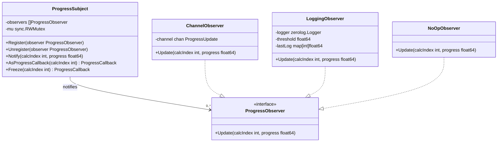
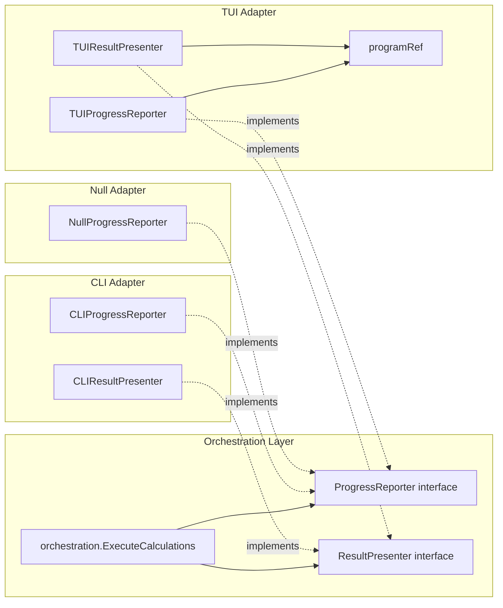

# Design Patterns

This document describes the six core design patterns used in the FibGo codebase, their
motivations, key types, and how they interact during a calculation.

For architectural context and ADRs, see [ARCHITECTURE.md](ARCHITECTURE.md).

---

## Table of Contents

1. [Observer Pattern](#1-observer-pattern)
2. [Strategy Pattern](#2-strategy-pattern)
3. [Factory + Registry Pattern](#3-factory--registry-pattern)
4. [Decorator Pattern](#4-decorator-pattern)
5. [Interface-Based Decoupling (Ports and Adapters)](#5-interface-based-decoupling-ports-and-adapters)
6. [Object Pooling](#6-object-pooling)
7. [Pattern Interactions](#7-pattern-interactions)
8. [Quick Reference](#8-quick-reference)

---

## 1. Observer Pattern

**Location**: `internal/fibonacci/observer.go`, `internal/fibonacci/observers.go`

The Observer pattern decouples Fibonacci algorithm implementations from their progress
consumers. A `ProgressSubject` maintains a list of `ProgressObserver` instances and
notifies them synchronously whenever calculation progress changes.

### Interface

```go
// internal/fibonacci/observer.go

type ProgressObserver interface {
    Update(calcIndex int, progress float64)
}
```

### Subject

```go
// internal/fibonacci/observer.go

type ProgressSubject struct {
    observers []ProgressObserver
    mu        sync.RWMutex
}
```

Key methods:

| Method | Description |
|--------|-------------|
| `Register(observer)` | Adds an observer. Nil observers are ignored. |
| `Unregister(observer)` | Removes an observer by identity comparison. |
| `Notify(calcIndex, progress)` | Notifies all observers under a read lock. |
| `AsProgressCallback(calcIndex)` | Returns a `ProgressCallback` closure that calls `Notify`. |
| `Freeze(calcIndex)` | Creates a lock-free snapshot of observers, returns a `ProgressCallback`. Used in hot loops. |

`AsProgressCallback` bridges the observer world to the functional `ProgressCallback`
type expected by `coreCalculator.CalculateCore()`, allowing algorithm code to
report progress without knowing about observers. `Freeze()` takes a snapshot of
the observer list so the callback can notify without acquiring any locks --
essential for performance-critical calculation loops.

### Concrete Observers

**ChannelObserver** (`observers.go`) -- adapts to channel-based communication for
backward compatibility with the orchestration layer's `progressChan`:

```go
// internal/fibonacci/observers.go

func (o *ChannelObserver) Update(calcIndex int, progress float64) {
    // ...
    select {
    case o.channel <- update:
    default:
        // Channel full, drop update (UI will catch up on next update)
    }
}
```

The non-blocking send prevents deadlocks when the UI consumer is slower than the
calculator producer.

**LoggingObserver** (`observers.go`) -- throttled zerolog logging. Only logs when
the progress delta exceeds a configurable threshold (default 10%), preventing log spam
during fast calculations:

```go
// internal/fibonacci/observers.go

type LoggingObserver struct {
    logger    zerolog.Logger
    threshold float64
    lastLog   map[int]float64
    mu        sync.Mutex
}
```

**NoOpObserver** (`observers.go`) -- Null Object pattern. Discards all updates
silently. Used in tests and quiet mode where no progress display is needed.

### Class Diagram



---

## 2. Strategy Pattern

**Location**: `internal/fibonacci/strategy.go`

The Strategy pattern encapsulates multiplication algorithms behind a common interface,
allowing calculators to switch between standard math/big, FFT, or adaptive selection at runtime
without modifying their doubling-step logic.

For the 3-tier multiplication threshold system, see [algorithms/FFT.md](algorithms/FFT.md).

### Interfaces

The Strategy pattern uses Interface Segregation (ISP) with two levels:

```go
// internal/fibonacci/strategy.go

// Narrow interface: consumers that only need Multiply/Square
type Multiplier interface {
    Multiply(z, x, y *big.Int, opts Options) (*big.Int, error)
    Square(z, x *big.Int, opts Options) (*big.Int, error)
    Name() string
}

// Wide interface: adds doubling-step-aware execution
type DoublingStepExecutor interface {
    Multiplier
    ExecuteStep(ctx context.Context, s *CalculationState, opts Options, inParallel bool) error
}

// Deprecated type alias preserved for backward compatibility
type MultiplicationStrategy = DoublingStepExecutor
```

`ExecuteStep` is a specialized method that performs a complete fast-doubling step. This
allows strategies like `FFTOnlyStrategy` to reuse FFT transforms across the two
multiplications in a single step, avoiding redundant forward transforms. The `ctx`
parameter enables cancellation checking between multiplications.

### Concrete Strategies

| Strategy | Selection Logic | Use Case |
|----------|----------------|----------|
| `AdaptiveStrategy` | Delegates to `smartMultiply`/`smartSquare`, which select standard `math/big` or FFT based on operand bit length and `opts.FFTThreshold` | Default production strategy |
| `FFTOnlyStrategy` | Forces `mulFFT`/`sqrFFT` for every operation | Benchmarking FFT, very large N |
| `KaratsubaStrategy` | Forces `math/big.Mul` for every operation | Testing, small-N comparison |

### AdaptiveStrategy Threshold Logic

```go
// internal/fibonacci/strategy.go

func (s *AdaptiveStrategy) ExecuteStep(ctx context.Context, state *CalculationState, opts Options, inParallel bool) error {
    if opts.FFTThreshold > 0 && state.FK1.BitLen() > opts.FFTThreshold {
        return executeDoublingStepFFT(ctx, state, opts, inParallel)
    }
    return executeDoublingStepMultiplications(ctx, s, state, opts, inParallel)
}
```

When operand bits exceed `FFTThreshold`, the strategy switches to the FFT path with
transform reuse. Below that threshold, it falls back to standard doubling-step
multiplications that use standard `big.Mul`.

---

## 3. Factory + Registry Pattern

**Location**: `internal/fibonacci/registry.go`

The Factory + Registry pattern provides lazy creation and caching of `Calculator`
instances. A global singleton (`GlobalFactory()`) pre-registers the three built-in
algorithms and supports dynamic registration for optional backends like GMP.

### Interface

```go
// internal/fibonacci/registry.go

type CalculatorFactory interface {
    Create(name string) (Calculator, error)
    Get(name string) (Calculator, error)
    List() []string
    Register(name string, creator func() coreCalculator) error
    GetAll() map[string]Calculator
}
```

### DefaultFactory

```go
// internal/fibonacci/registry.go

type DefaultFactory struct {
    mu          sync.RWMutex
    creators    map[string]func() coreCalculator
    calculators map[string]Calculator
}
```

**Pre-registered algorithms** (in `NewDefaultFactory()`):

| Name | Creator | Algorithm |
|------|---------|-----------|
| `"fast"` | `func() coreCalculator { return &OptimizedFastDoubling{} }` | O(log n), parallel, zero-alloc |
| `"matrix"` | `func() coreCalculator { return &MatrixExponentiation{} }` | O(log n), parallel, Strassen |
| `"fft"` | `func() coreCalculator { return &FFTBasedCalculator{} }` | O(log n), FFT-accelerated |

### Double-Checked Locking in Get()

`Get()` uses a double-checked locking pattern to minimize lock contention during
concurrent access:

```go
// internal/fibonacci/registry.go

func (f *DefaultFactory) Get(name string) (Calculator, error) {
    // Check cache first with read lock
    f.mu.RLock()
    if calc, exists := f.calculators[name]; exists {
        f.mu.RUnlock()
        return calc, nil
    }
    f.mu.RUnlock()

    // Create new calculator with write lock
    f.mu.Lock()
    defer f.mu.Unlock()

    // Double-check after acquiring write lock
    if calc, exists := f.calculators[name]; exists {
        return calc, nil
    }
    // ... create and cache
}
```

### GMP Auto-Registration

When built with `-tags=gmp`, the `calculator_gmp.go` file's `init()` function
automatically registers a `"gmp"` calculator via `RegisterCalculator()`. No code
changes are needed in the factory -- the Go build tag system and the registry's
`Register()` method handle it transparently.

### Singleton Access

```go
var globalFactory = NewDefaultFactory()

func GlobalFactory() *DefaultFactory { return globalFactory }

func RegisterCalculator(name string, creator func() coreCalculator) error {
    return globalFactory.Register(name, creator)
}
```

---

## 4. Decorator Pattern

**Location**: `internal/fibonacci/calculator.go`

The Decorator pattern wraps raw algorithm implementations (`coreCalculator`) with
cross-cutting concerns without modifying the algorithm code. `FibCalculator` is the
sole decorator, adding four responsibilities on top of the core algorithm.

### Interfaces

```go
// internal/fibonacci/calculator.go

// Public interface consumed by orchestration
type Calculator interface {
    Calculate(ctx context.Context, progressChan chan<- ProgressUpdate,
        calcIndex int, n uint64, opts Options) (*big.Int, error)
    Name() string
}

// Internal interface for pure algorithm implementations
type coreCalculator interface {
    CalculateCore(ctx context.Context, reporter ProgressCallback,
        n uint64, opts Options) (*big.Int, error)
    Name() string
}
```

### FibCalculator Wrapping

```go
// internal/fibonacci/calculator.go

type FibCalculator struct {
    core coreCalculator
}
```

### Responsibilities Added by the Decorator

1. **Small-N fast path**: For `n <= 93` (the largest Fibonacci number fitting in a
   `uint64`), the decorator bypasses the core algorithm entirely and uses iterative
   addition.

2. **Observer bridging**: `Calculate()` creates a `ProgressSubject` with a
   `ChannelObserver`, then delegates to `CalculateWithObservers()`. This provides
   backward compatibility with channel-based progress reporting.

3. **FFT cache configuration**: Calls `configureFFTCache(opts)` to set cache
   parameters before the core algorithm runs.

4. **Pool pre-warming**: Calls `bigfft.EnsurePoolsWarmed(n)` to ensure memory pools
   are sized for the expected calculation before entering the hot loop.

```go
// internal/fibonacci/calculator.go

func (c *FibCalculator) CalculateWithObservers(ctx context.Context, subject *ProgressSubject,
    calcIndex int, n uint64, opts Options) (result *big.Int, err error) {
    // ...
    if n <= MaxFibUint64 {
        reporter(1.0)
        return calculateSmall(n), nil
    }
    configureFFTCache(opts)
    bigfft.EnsurePoolsWarmed(n)
    result, err = c.core.CalculateCore(ctx, reporter, n, opts)
    // ...
}
```

---

## 5. Interface-Based Decoupling (Ports and Adapters)

**Location**: `internal/orchestration/interfaces.go`, `internal/cli/presenter.go`, `internal/tui/bridge.go`

The orchestration layer defines two interfaces that act as ports. The CLI and TUI
packages provide adapter implementations, ensuring that business logic never imports
presentation packages. This follows Clean Architecture principles (see
[ARCHITECTURE.md](ARCHITECTURE.md), ADR-004).

### Interfaces (Ports)

```go
// internal/orchestration/interfaces.go

type ProgressReporter interface {
    DisplayProgress(wg *sync.WaitGroup, progressChan <-chan fibonacci.ProgressUpdate,
        numCalculators int, out io.Writer)
}

type ResultPresenter interface {
    PresentComparisonTable(results []CalculationResult, out io.Writer)
    PresentResult(result CalculationResult, n uint64, verbose, details, showValue bool, out io.Writer)
    FormatDuration(d time.Duration) string
    HandleError(err error, duration time.Duration, out io.Writer) int
}
```

### Adapters

| Adapter | Package | Mechanism |
|---------|---------|-----------|
| `CLIProgressReporter` | `internal/cli/presenter.go` | Delegates to spinner + progress bar display functions |
| `CLIResultPresenter` | `internal/cli/presenter.go` | Formats colorized output to `io.Writer` |
| `TUIProgressReporter` | `internal/tui/bridge.go` | Drains channel, sends `ProgressMsg` to Bubble Tea |
| `TUIResultPresenter` | `internal/tui/bridge.go` | Sends `ComparisonResultsMsg` / `FinalResultMsg` to Bubble Tea |
| `NullProgressReporter` | `internal/orchestration/interfaces.go` | Drains channel silently (quiet mode, testing) |

### TUI Bridge Detail

The TUI adapter uses a `programRef` struct to hold a pointer to the `*tea.Program`
that survives Bubble Tea model copies (Bubble Tea uses value semantics):

```go
// internal/tui/bridge.go

type programRef struct {
    program *tea.Program
}

func (r *programRef) Send(msg tea.Msg) {
    if r.program != nil {
        r.program.Send(msg)
    }
}
```

`tea.Program.Send()` is thread-safe, so the bridge goroutine (running
`DisplayProgress`) can send messages concurrently with the Bubble Tea event loop.

For TUI dashboard details, see [TUI_GUIDE.md](TUI_GUIDE.md).

### Dependency Direction Diagram



Arrows point from dependant to dependency. Dashed arrows represent interface
implementation. The orchestration layer depends only on the interfaces it defines --
it never imports `cli` or `tui`.

---

## 6. Object Pooling

**Location**: `internal/fibonacci/` (calculation states), `internal/bigfft/pool.go`, `internal/bigfft/bump.go`

Object pooling reduces GC pressure for the millions of temporary allocations generated
during large Fibonacci calculations. The project uses two complementary approaches:
`sync.Pool`-based size-classed pools and a bump allocator.

For pool implementation details, see [algorithms/BIGFFT.md](algorithms/BIGFFT.md).

### sync.Pool Pools (internal/bigfft/pool.go)

All pools use size classes. Objects are acquired with `acquire*` and released with
`release*` functions (always paired with `defer`):

| Pool | Size Classes | Element Type |
|------|-------------|--------------|
| `wordSlicePools` | 10 classes: 64 to 16M words | `[]big.Word` |
| `fermatPools` | 9 classes: 32 to 2M | `fermat` |
| `natSlicePools` | 7 classes: 8 to 32K | `[]nat` |
| `fermatSlicePools` | 7 classes: 8 to 32K | `[]fermat` |
| `fftStatePool` | single | `*fftState` (bundles FFT temporaries) |

Example usage pattern:

```go
slice := acquireWordSlice(size)
defer releaseWordSlice(slice)
```

The `fftState` pool bundles all temporaries for a single FFT multiplication into one
object, reducing individual pool lookups:

```go
// internal/bigfft/pool.go

type fftState struct {
    tmp  fermat
    tmp2 fermat
    n    int
    k    uint
}
```

### Fibonacci Calculation State Pools

`CalculationState` and `matrixState` pools in `internal/fibonacci/` recycle the
`big.Int` temporaries used during fast-doubling and matrix exponentiation steps.
A `MaxPooledBitLen` cap (100M bits, ~12.5 MB) prevents excessively large objects from being
retained in the pool. This limit was increased from 4M to allow pooling of intermediate
results for large Fibonacci calculations (e.g., F(10^8)).

### BumpAllocator (internal/bigfft/bump.go)

For FFT operations that need many small, short-lived allocations released together,
the bump allocator provides O(1) allocation with zero fragmentation:

```go
// internal/bigfft/bump.go

type BumpAllocator struct {
    buffer []big.Word
    offset int
}
```

| Property | Value |
|----------|-------|
| Allocation cost | O(1) pointer bump |
| Fragmentation | Zero (contiguous memory) |
| Thread safety | NOT thread-safe (one per goroutine) |
| Lifecycle | `AcquireBumpAllocator` / `ReleaseBumpAllocator` via `sync.Pool` |
| Fallback | If capacity is exceeded, falls back to `make()` |

The allocator offers `Alloc` (zeroed), `AllocUnsafe` (unzeroed), `AllocFermat`, and
`AllocFermatSlice` methods, covering all FFT temporary allocation needs.

`EstimateBumpCapacity(wordLen)` provides a heuristic for pre-sizing the buffer based
on FFT algorithm memory patterns (approximately `2 * K * (n+1)` for transforms plus
`8 * n` for multiply temporaries, with a 20% safety margin).

---

## 7. Pattern Interactions

During a single `Calculate()` call, all six patterns cooperate in a layered call chain:

```
Calculate()                                   [Decorator]
  |
  +-- ProgressSubject.Register(ChannelObserver) [Observer]
  |
  +-- CalculateWithObservers()                  [Decorator]
       |
       +-- calculateSmall(n) if n <= 93         [Decorator: fast path]
       |
       +-- bigfft.EnsurePoolsWarmed(n)          [Object Pooling]
       |
       +-- core.CalculateCore()                 [Decorator -> coreCalculator]
            |
            +-- strategy.ExecuteStep()           [Strategy]
            |    |
            |    +-- smartMultiply / mulFFT      [Strategy: algorithm selection]
            |         |
            |         +-- acquireWordSlice()     [Object Pooling]
            |         +-- AcquireBumpAllocator() [Object Pooling]
            |
            +-- reporter(progress)               [Observer: via Freeze()]
                 |
                 +-- subject.Notify()            [Observer]
                      |
                      +-- ChannelObserver.Update() -> progressChan
                      +-- LoggingObserver.Update() -> zerolog
```

The Factory + Registry pattern operates at a higher level -- it creates the
`FibCalculator` (decorator wrapping a `coreCalculator`) before `Calculate()` is ever
called. The Interface-Based Decoupling pattern operates at the orchestration level,
where `ProgressReporter.DisplayProgress()` consumes the `progressChan` that the
`ChannelObserver` writes to.

### End-to-End Data Flow

```
CalculatorFactory.Get("fast")           -- Factory creates FibCalculator(OptimizedFastDoubling)
  |
orchestration.ExecuteCalculations()     -- Orchestration calls Calculator.Calculate()
  |
FibCalculator.Calculate()               -- Decorator creates Subject + ChannelObserver
  |
FibCalculator.CalculateWithObservers()  -- Decorator: fast path, pool warming, delegation
  |
OptimizedFastDoubling.CalculateCore()   -- Core algorithm uses Strategy for multiplication
  |
AdaptiveStrategy.ExecuteStep()          -- Strategy selects FFT or math/big
  |
ProgressSubject.Notify()                -- Observer forwards progress
  |
ChannelObserver -> progressChan         -- Channel bridges to orchestration layer
  |
CLIProgressReporter.DisplayProgress()   -- Interface adapter consumes channel
```

---

## 8. Quick Reference

| Pattern | Location | Key Types | Purpose |
|---------|----------|-----------|---------|
| Observer | `internal/fibonacci/observer.go`, `observers.go` | `ProgressObserver`, `ProgressSubject` (with `Freeze()`), `ChannelObserver`, `LoggingObserver`, `NoOpObserver` | Decouple algorithms from progress consumers |
| Strategy | `internal/fibonacci/strategy.go` | `Multiplier`, `DoublingStepExecutor`, `AdaptiveStrategy`, `FFTOnlyStrategy`, `KaratsubaStrategy` | Swap multiplication algorithms at runtime |
| Factory + Registry | `internal/fibonacci/registry.go` | `CalculatorFactory`, `DefaultFactory`, `GlobalFactory()` | Lazy creation, caching, and dynamic registration of calculators |
| Decorator | `internal/fibonacci/calculator.go` | `Calculator`, `coreCalculator`, `FibCalculator` | Add small-N fast path, observer bridging, pool warming around core algorithms |
| Ports and Adapters | `internal/orchestration/interfaces.go`, `internal/cli/presenter.go`, `internal/tui/bridge.go` | `ProgressReporter`, `ResultPresenter`, `CLIProgressReporter`, `TUIProgressReporter`, `programRef` | Decouple orchestration from CLI/TUI presentation |
| Object Pooling | `internal/bigfft/pool.go`, `internal/bigfft/bump.go` | `wordSlicePools`, `fermatPools`, `fftState`, `BumpAllocator` | Reduce GC pressure via size-classed `sync.Pool` and O(1) bump allocation |
