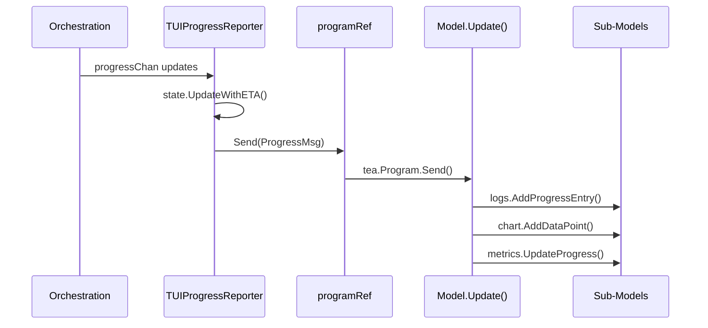

# TUI Developer Guide

Interactive terminal dashboard inspired by btop, built on Bubble Tea (Elm architecture).
Activated via the `--tui` flag or the `FIBCALC_TUI=true` environment variable.

For architectural context, see [ARCHITECTURE.md](ARCHITECTURE.md).
For the bridge pattern and interface-based decoupling, see [DESIGN_PATTERNS.md](DESIGN_PATTERNS.md).

---

## Table of Contents

1. [Quick Start](#1-quick-start)
2. [Elm Architecture (Model-Update-View)](#2-elm-architecture-model-update-view)
3. [Layout](#3-layout)
4. [Sub-Models](#4-sub-models)
5. [Message System](#5-message-system)
6. [Message Flow](#6-message-flow)
7. [Bridge Pattern (Orchestration Integration)](#7-bridge-pattern-orchestration-integration)
8. [Keyboard Navigation](#8-keyboard-navigation)
9. [Calculation Lifecycle](#9-calculation-lifecycle)
10. [Styling](#10-styling)
11. [Run() Entry Point](#11-run-entry-point)
12. [Extending the TUI](#12-extending-the-tui)

---

## 1. Quick Start

```bash
fibcalc --tui -n 10000000
fibcalc --tui -n 5000000 -algo all
```

The first command launches the TUI calculating F(10,000,000) with the default algorithm.
The second runs all registered algorithms concurrently and displays a comparison summary.

---

## 2. Elm Architecture (Model-Update-View)

**File**: `internal/tui/model.go`

The TUI follows the Elm architecture enforced by Bubble Tea. All state lives in a single
`Model` struct. On every event, `Update()` returns a new model and an optional command.
`View()` is a pure function that renders the model to a string.

### Root Model

```go
type Model struct {
    header  HeaderModel
    logs    LogsModel
    metrics MetricsModel
    chart   ChartModel
    footer  FooterModel
    keymap  KeyMap
    parentCtx, ctx context.Context
    cancel         context.CancelFunc
    config         config.AppConfig
    calculators    []fibonacci.Calculator
    generation     uint64
    ref            *programRef
    width, height  int
    paused, done   bool
    exitCode       int
}
```

| Field | Purpose |
|-------|---------|
| `parentCtx` / `ctx` / `cancel` | Parent context survives restarts; child context is recreated on reset |
| `generation` | Monotonic counter that invalidates stale messages from previous calculations |
| `ref` | Heap-allocated pointer to `tea.Program` that survives model copies |

### Init

```go
func (m Model) Init() tea.Cmd {
    return tea.Batch(
        tickCmd(),
        startCalculationCmd(m.ref, m.ctx, m.calculators, m.config, m.generation),
        watchContextCmd(m.ctx, m.generation),
    )
}
```

- `tickCmd()` -- periodic 500ms timer for metric sampling
- `startCalculationCmd()` -- orchestration entry point (runs calculators, analyzes results)
- `watchContextCmd()` -- waits for context cancellation to trigger `tea.Quit`

### View

```go
func (m Model) View() string {
    rightCol := lipgloss.JoinVertical(lipgloss.Left, m.metrics.View(), m.chart.View())
    body := lipgloss.JoinHorizontal(lipgloss.Top, m.logs.View(), rightCol)
    return lipgloss.JoinVertical(lipgloss.Left, m.header.View(), body, m.footer.View())
}
```

---

## 3. Layout

```
+------------------------------ Header (3 rows) ------------------------------+
| FibGo Monitor            v1.0.0                      Elapsed: 00:01:23      |
+-------- Logs (60%) --------+----- Right Column (40%) ----------------------+
|                            |  Metrics (40% of right height)                 |
| [15:04:05] Fast...  45%   |   Memory:     1.2 GB                           |
| [15:04:06] Matrix.. 42%   |   Heap:       980 MB                           |
|                            |   GC Runs:    12                               |
|                            |   Goroutines: 24                               |
|                            +---- Chart (60% of right height) ---------------+
|                            |  Progress Chart                                |
|                            |  [####.....] 62.3%                             |
|                            |  ETA: 45s                                      |
+----------------------------+------------------------------------------------+
| q: Quit  r: Restart  space: Pause/Resume                  Status: Running   |
+-----------------------------------------------------------------------------+
```

Constants: `headerHeight=3`, `footerHeight=3`, `minBodyHeight=4`.

`layoutPanels()` is called on every `WindowSizeMsg`: logsWidth = 60%, rightWidth = 40%,
metricsH = 40% of body, chartH = 60% of body.

---

## 4. Sub-Models

| Sub-Model | File | Responsibility |
|-----------|------|----------------|
| `HeaderModel` | `header.go` | Title, version, elapsed time (freezes on done via `SetDone()`, resets via `Reset()`) |
| `LogsModel` | `logs.go` | Scrollable viewport, auto-scroll, color-coded entries, max 10,000 entries |
| `MetricsModel` | `metrics.go` | Memory, heap, GC, goroutines, speed (EMA smoothing, alpha=0.3) |
| `ChartModel` | `chart.go` | Progress bar with filled/empty blocks, percentage, ETA or completion time |
| `FooterModel` | `footer.go` | Keyboard shortcuts display, status indicator (Running/Paused/Done/Error) |

**LogsModel** uses a Bubbles `viewport.Model` for scrolling. Auto-scroll tracks whether
the viewport is at the bottom; manual scrolling disables it.

**MetricsModel** computes speed via EMA to smooth jitter:

```go
instantSpeed := dp / dt
if m.speed > 0 {
    m.speed = 0.7*m.speed + 0.3*instantSpeed
} else {
    m.speed = instantSpeed
}
```

**ChartModel** renders a progress bar using Unicode block characters. Bar width adapts to
the panel width. When done, displays total elapsed time instead of ETA.

**FooterModel** status priority: Error > Done > Paused > Running.

---

## 5. Message System

**File**: `internal/tui/messages.go`

| Message Type | Fields | Source | Handled In |
|-------------|--------|--------|------------|
| `ProgressMsg` | `CalculatorIndex`, `Value`, `AverageProgress`, `ETA` | `TUIProgressReporter` | logs, chart, metrics |
| `ProgressDoneMsg` | -- | `TUIProgressReporter` | no-op |
| `ComparisonResultsMsg` | `Results []CalculationResult` | `TUIResultPresenter` | logs |
| `FinalResultMsg` | `Result`, `N`, `Verbose`, `Details`, `ShowValue` | `TUIResultPresenter` | logs |
| `ErrorMsg` | `Err`, `Duration` | `TUIResultPresenter` | logs, footer |
| `TickMsg` | `time.Time` | `tickCmd()` (500ms) | triggers `sampleMemStatsCmd()` |
| `MemStatsMsg` | `Alloc`, `HeapInuse`, `NumGC`, `NumGoroutine` | `sampleMemStatsCmd()` | metrics |
| `CalculationCompleteMsg` | `ExitCode`, `Generation` | `startCalculationCmd()` | header, chart, footer |
| `ContextCancelledMsg` | `Err`, `Generation` | `watchContextCmd()` | triggers `tea.Quit` |

---

## 6. Message Flow



The bridge goroutine drains the progress channel, computes ETA via
`cli.NewProgressWithETA()`, and forwards updates through `programRef.Send()`.

---

## 7. Bridge Pattern (Orchestration Integration)

**File**: `internal/tui/bridge.go`

### programRef

```go
type programRef struct {
    program *tea.Program
}

func (r *programRef) Send(msg tea.Msg) {
    if r.program != nil {
        r.program.Send(msg)
    }
}
```

**Problem**: Bubble Tea copies the Model on every `Update()`, so goroutines cannot hold a
stable reference to the model.

**Solution**: `programRef` is heap-allocated with a pointer to `tea.Program`. The model
stores `*programRef`, which survives copies. `tea.Program.Send()` is thread-safe.

### TUIProgressReporter

Implements `orchestration.ProgressReporter`. Drains the progress channel, computes ETA,
and sends `ProgressMsg` for each update. Sends `ProgressDoneMsg` when the channel closes.

### TUIResultPresenter

Implements `orchestration.ResultPresenter`:

| Method | Message Sent |
|--------|-------------|
| `PresentComparisonTable()` | `ComparisonResultsMsg` |
| `PresentResult()` | `FinalResultMsg` |
| `HandleError()` | `ErrorMsg` |
| `FormatDuration()` | Delegates to `cli.FormatExecutionDuration()` |

---

## 8. Keyboard Navigation

**File**: `internal/tui/keymap.go`

| Key | Action | Implementation |
|-----|--------|----------------|
| `q` / `Ctrl+C` | Quit | Cancels context, returns `tea.Quit` |
| `Space` | Pause/Resume | Toggles `m.paused`, blocks metric sampling and log updates |
| `r` | Restart calculation | `generation++`, new context, reset all sub-models, re-launch batch |
| `Up` / `k` | Scroll logs up | Delegates to `logs.Update(msg)` via viewport |
| `Down` / `j` | Scroll logs down | Delegates to `logs.Update(msg)` via viewport |
| `PgUp` / `PgDn` | Fast scroll | Delegates to `logs.Update(msg)` via viewport |

---

## 9. Calculation Lifecycle

### Start

`Init()` returns `tea.Batch(tickCmd(), startCalculationCmd(...), watchContextCmd(...))`.
`startCalculationCmd()` creates bridge reporters, calls
`orchestration.ExecuteCalculations()` then `AnalyzeComparisonResults()`, and returns
`CalculationCompleteMsg`.

### Progress

- `TickMsg` triggers `sampleMemStatsCmd()` (skipped when done or paused).
- `ProgressMsg` updates logs, chart, and metrics (skipped when paused).
- While paused, calculations continue running -- only UI updates are blocked.

### Reset (r key)

1. Cancel current context via `m.cancel()`.
2. Increment `m.generation` to invalidate stale messages.
3. Create new `context.WithCancel(parentCtx)`.
4. Reset all sub-models.
5. Re-launch command batch.

### Completion

- `CalculationCompleteMsg`: checks generation match, marks done, freezes header timer,
  sets chart done with elapsed time.
- `ContextCancelledMsg`: checks generation match, marks done, triggers `tea.Quit`.

### Generation Guard

Both completion messages carry a `Generation` field. Mismatches are discarded:

```go
case CalculationCompleteMsg:
    if msg.Generation != m.generation {
        return m, nil // stale message from previous calculation
    }
```

---

## 10. Styling

**File**: `internal/tui/styles.go`

### Color Palette

| Variable | Hex | Role |
|----------|-----|------|
| `colorBg` | `#000000` | Background |
| `colorText` | `#a9b1d6` | Default text |
| `colorBorder` | `#3b4261` | Panel borders |
| `colorAccent` | `#7aa2f7` | Titles, progress bars, shortcut keys |
| `colorSuccess` | `#9ece6a` | Success indicators, Running status |
| `colorWarning` | `#e0af68` | Paused status |
| `colorError` | `#f7768e` | Error indicators, Error status |
| `colorDim` | `#565f89` | Timestamps, labels, empty progress bar |
| `colorCyan` | `#7dcfff` | Elapsed time, metric values |
| `colorMagenta` | `#bb9af7` | Algorithm names |

### Key Styles

| Style | Used For |
|-------|----------|
| `panelStyle` | All bordered panels (rounded border, dark background) |
| `headerStyle` | Header and footer bars |
| `chartBarStyle` / `chartEmptyStyle` | Filled and empty portions of progress bar |
| `statusRunningStyle` | Green "Status: Running" |
| `statusPausedStyle` | Yellow "Status: Paused" |
| `statusDoneStyle` | Blue "Status: Done" |
| `statusErrorStyle` | Red "Status: Error" |

---

## 11. Run() Entry Point

```go
func Run(ctx context.Context, calculators []fibonacci.Calculator,
    cfg config.AppConfig, version string) int {
    model := NewModel(ctx, calculators, cfg, version)
    defer model.cancel()
    p := tea.NewProgram(model, tea.WithAltScreen())
    model.ref.program = p  // Inject program reference before Run
    finalModel, err := p.Run()
    // ...
}
```

- `tea.WithAltScreen()` enters the alternate terminal buffer.
- `model.ref.program = p` injects the reference before `p.Run()` so bridge goroutines
  spawned by `Init()` have a valid `Send()` target.
- The final model is type-asserted to extract the exit code for the process.

---

## 12. Extending the TUI

### Adding a New Panel

1. Create a new sub-model file (e.g., `newpanel.go`) with `SetSize()` and `View()`.
2. Add the sub-model field to `Model` in `model.go`.
3. Initialize in `NewModel()`.
4. Add sizing in `layoutPanels()`.
5. Render in `View()`.

### Adding a New Message Type

1. Define the message struct in `messages.go`.
2. Add a `case` in `Model.Update()`.
3. Send from a bridge method or `tea.Cmd` function.

### Adding a New Keyboard Shortcut

1. Add a binding in `keymap.go` (`DefaultKeyMap()`).
2. Add a `case` in `handleKey()` in `model.go`.
3. Update `FooterModel.View()` to display the new shortcut.

---

## Cross-References

- [DESIGN_PATTERNS.md](DESIGN_PATTERNS.md) -- Observer and interface-based decoupling patterns
- [ARCHITECTURE.md](ARCHITECTURE.md) -- Presentation Layer and ADR-004
- [algorithms/PROGRESS_BAR_ALGORITHM.md](algorithms/PROGRESS_BAR_ALGORITHM.md) -- Progress calculation math
- [BUILD.md](BUILD.md) -- `--tui` flag and `FIBCALC_TUI` env var
