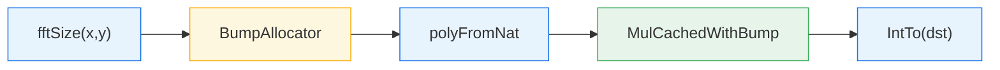
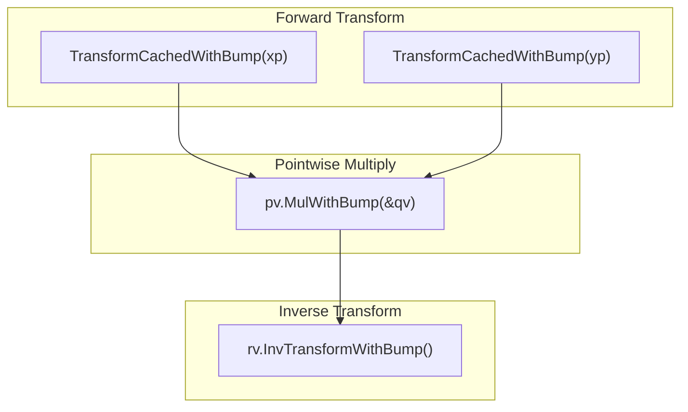
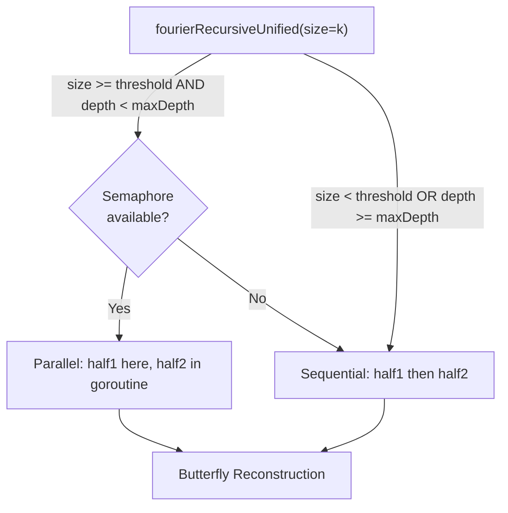
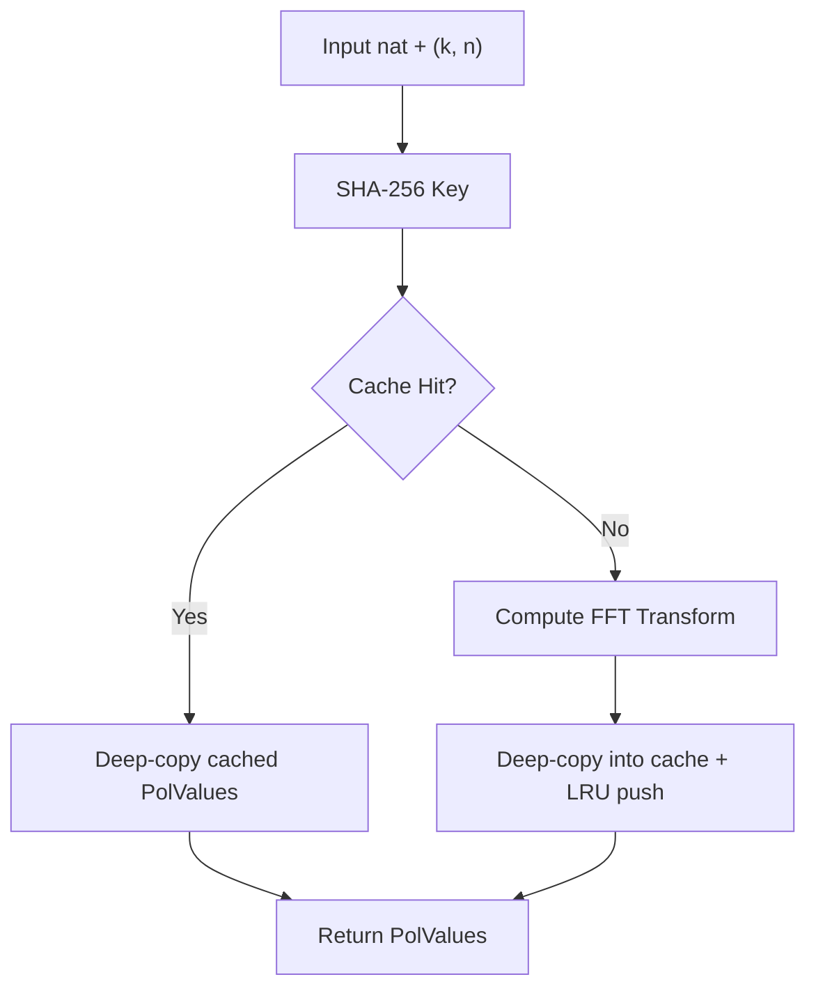
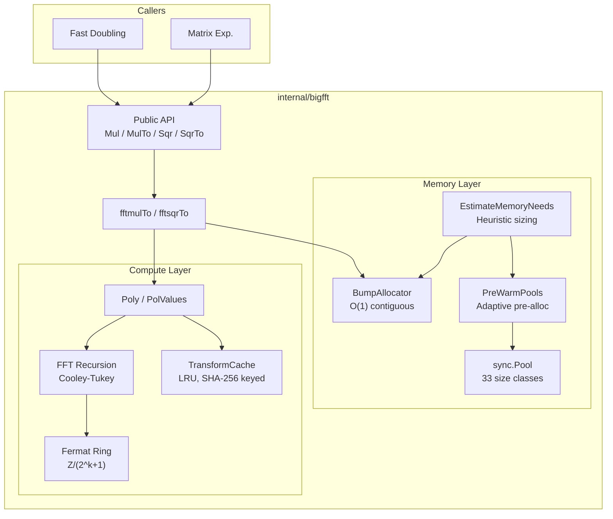

# BigFFT Subsystem: Implementation Internals

> **Scope**: Implementation architecture of `internal/bigfft`
> **Complexity**: O(n log n) integer multiplication via Schonhage-Strassen FFT
> **See also**: [FFT.md](FFT.md) for mathematical theory and 3-tier multiplication selection

## Overview

The `internal/bigfft` package implements **Schonhage-Strassen FFT multiplication** over
Fermat rings for arbitrarily large integers. It is the computational backbone of all
Fibonacci algorithms in this project once operand sizes exceed ~500,000 bits.

The subsystem comprises ~30 source files totalling approximately 8,000 lines of Go,
organized around four concerns:

1. **Public API** -- panic-safe entry points for multiplication and squaring
2. **FFT core** -- polynomial decomposition, forward/inverse transforms, pointwise operations
3. **Fermat arithmetic** -- modular arithmetic in Z/(2^k+1) where multiplications reduce to shifts
4. **Memory management** -- four pool hierarchies, a bump allocator, pre-warming, and capacity estimation

---

## Public API

**File**: `internal/bigfft/fft.go`

```go
func Mul(x, y *big.Int) (res *big.Int, err error)
func MulTo(z, x, y *big.Int) (res *big.Int, err error)
func Sqr(x *big.Int) (res *big.Int, err error)
func SqrTo(z, x *big.Int) (res *big.Int, err error)
```

All four functions wrap their core logic in `defer/recover` to convert panics into
returned errors. This guarantees that a malformed input or internal bug never crashes
the caller.

**Threshold gating**: `Mul`/`MulTo` and `Sqr`/`SqrTo` compare the operand word count
against `fftThreshold` (default 1800 words, ~115 Kbits on 64-bit). Operands below the
threshold fall through to `math/big.Mul`, avoiding FFT overhead for small numbers.

**Squaring optimization**: `Sqr`/`SqrTo` only transform the input once, saving
approximately 33% of the FFT computation compared to `Mul`.

---

## Internal Data Flow

The heart of the package is `fftmulTo`, which orchestrates a complete FFT multiplication.

**File**: `internal/bigfft/fft_core.go`

```go
func fftmulTo(dst, x, y nat) (nat, error) {
    k, m := fftSize(x, y)
    wordLen := len(x) + len(y)
    ba := AcquireBumpAllocator(EstimateBumpCapacity(wordLen))
    defer ReleaseBumpAllocator(ba)
    xp := polyFromNat(x, k, m)
    yp := polyFromNat(y, k, m)
    rp, err := xp.MulCachedWithBump(&yp, ba)
    if err != nil {
        return nil, err
    }
    return rp.IntTo(dst), nil
}
```

### Pipeline Stages



| Stage | Responsibility |
|-------|---------------|
| `fftSize` | Select FFT length K=2^k and chunk size m from `fftSizeThreshold` table |
| `BumpAllocator` | Pre-allocate a contiguous word buffer for all temporaries |
| `polyFromNat` | Split the input `nat` into a polynomial of K chunks of m words |
| `MulCachedWithBump` | Forward FFT, pointwise multiply, inverse FFT (with transform caching) |
| `IntTo` | Reassemble polynomial back into a single `nat` with carry propagation |

### Detailed Multiplication Pipeline

Within `MulCachedWithBump`, the following sequence executes:



1. **Forward transform** each polynomial into `PolValues` (evaluation at roots of unity)
2. **Pointwise multiply** the two sets of values in the Fermat ring
3. **Inverse transform** the product back to coefficient form

---

## FFT Size Selection

**File**: `internal/bigfft/fft.go`

The `fftSize` function determines optimal FFT parameters from a lookup table:

```go
var fftSizeThreshold = [...]int64{0, 0, 0,
    4<<10, 8<<10, 16<<10,            // k=3..5
    32<<10, 64<<10, 1<<18, 1<<20, 3<<20, // k=6..10
    8<<20, 30<<20, 100<<20, 300<<20, 600<<20,  // k=11..15
}
```

The FFT length K = 2^k is chosen so that `fftSizeThreshold[k]` exceeds the total
result bit-length. The chunk size m satisfies `m << k > len(x) + len(y)`, ensuring
the polynomial representation can hold the full product.

**Design principle**: K is approximately 2*sqrt(N) where N is the total bit-length
of the product. This balances the cost of the O(K log K) FFT against the O(m^2)
coefficient multiplications.

---

## Polynomial Representation

**File**: `internal/bigfft/fft_poly.go`

```go
type Poly struct {
    K uint   // 1<<K is the FFT length
    M int    // words per chunk: P(b^M) recovers the original number
    A []nat  // up to 1<<K coefficients, each M words
}
```

### Key Operations

| Function | Purpose |
|----------|---------|
| `polyFromNat(x, k, m)` | Slice a `nat` into a polynomial with 2^k coefficients of m words |
| `IntTo(dst)` | Reassemble polynomial back to `nat` via carry-propagating addition |
| `Transform(n)` / `TransformWithBump(n, ba)` | Forward FFT: evaluate at K-th roots of unity |
| `InvTransform()` / `InvTransformWithBump(ba)` | Inverse FFT: reconstruct from point values |
| `MulCached(q)` / `MulCachedWithBump(q, ba)` | Full cached FFT multiply pipeline |
| `SqrCached()` / `SqrCachedWithBump(ba)` | Optimized squaring (single transform) |

### PolValues Type

```go
type PolValues struct {
    K      uint     // log2 of FFT length
    N      int      // coefficient word length
    Values []fermat // 1<<K evaluated points
}
```

`PolValues` represents a polynomial evaluated at K-th roots of unity. Pointwise
multiplication (`Mul`) and squaring (`Sqr`) operate on this type. The `Clone()`
method produces a deep copy for safe concurrent use.

---

## Fermat Ring Arithmetic

**File**: `internal/bigfft/fermat.go`

```go
type fermat nat  // []big.Word of length n+1, representing a number mod 2^(n*W)+1
```

A `fermat` of length w+1 represents a number in the ring **Z/(2^(w*W)+1)** where
W is the machine word size (64 bits). The last word is constrained to 0 or 1.

### Why Fermat Rings?

The key property: in Z/(2^k+1), powers of 2 are roots of unity. This means
multiplications by roots of unity in the FFT become **bit shifts** rather than
full multiplications, dramatically reducing cost.

### Operations

| Method | Description |
|--------|-------------|
| `Shift(x, k)` | Compute (x << k) mod (2^n+1) via word-aligned copy and borrow |
| `ShiftHalf(x, k, tmp)` | Shift by k/2 bits using sqrt(2) = 2^(3n/4) - 2^(n/4) identity |
| `Add(x, y)` | Modular addition with normalization |
| `Sub(x, y)` | Modular subtraction with borrow handling |
| `Mul(x, y)` | Full modular multiplication (uses `basicMul` below threshold) |
| `norm()` | Normalize: ensure last word is 0 or 1 |

The `Mul` method switches between `basicMul` (schoolbook, for operands below
`smallMulThreshold = 30` words) and `big.Int.Mul` for larger operands, with subsequent
modular reduction. The `Sqr` method provides an optimized squaring path that similarly
dispatches between `basicSqr` and `big.Int.Mul` based on operand size.

The `smallMulThreshold` (30 words, ~1,920 bits on 64-bit) was determined empirically.
Below this threshold, the schoolbook `basicMul`/`basicSqr` functions avoid `big.Int`
allocation overhead and are faster for the small operands common in early FFT recursion levels.

---

## FFT Transform

**Files**: `internal/bigfft/fft_core.go`, `internal/bigfft/fft_recursion.go`

### Entry Points

| Function | Description |
|----------|-------------|
| `fourier(dst, src, backward, n, k)` | Top-level FFT using pool-allocated temporaries |
| `fourierWithState(dst, src, backward, n, k, state)` | FFT with pre-allocated `fftState` |
| `fourierWithBump(dst, src, backward, n, k, ba)` | FFT using bump allocator (best cache locality) |

All entry points delegate to the recursive core.

### Recursive Decomposition

**File**: `internal/bigfft/fft_recursion.go`

```go
func fourierRecursiveUnified(dst, src []fermat, backward bool, n int,
    k, size, depth uint, tmp, tmp2 fermat, alloc TempAllocator) error
```

The FFT uses a **Cooley-Tukey radix-2 decimation-in-frequency** decomposition:

1. **Base cases**: size=0 (copy) and size=1 (butterfly: add/sub)
2. **Recursive split**: divide into two halves, recurse on each
3. **Reconstruct**: apply twiddle factors via `ShiftHalf` and butterfly operations

### Parallelism Control

FFT parallelism is controlled by two **runtime-configurable** variables (default values shown):

| Variable | Default | Purpose |
|----------|---------|---------|
| `ParallelFFTRecursionThreshold` | 4 | Minimum k for parallel recursion |
| `MaxParallelFFTDepth` | 3 | Maximum parallel recursion depth |

These can be adjusted at runtime via the `FFTParallelismConfig` struct:

```go
// Read current configuration
config := bigfft.GetFFTParallelismConfig()

// Update configuration
bigfft.SetFFTParallelismConfig(bigfft.FFTParallelismConfig{
    RecursionThreshold: 5,  // Increase minimum for parallel recursion
    MaxDepth:           2,  // Reduce parallel depth
})
```

Parallelism uses a semaphore channel sized to `runtime.NumCPU()`. When a goroutine
slot is available, the second half of the recursion runs in a new goroutine with
pool-allocated temporary buffers (avoiding races on the non-thread-safe bump allocator).
If no slot is available, execution falls through to sequential.



---

## Memory Management

### Pool System

**File**: `internal/bigfft/pool.go`

Four `sync.Pool` hierarchies with geometrically-spaced size classes minimize
allocation overhead and fragmentation:

| Pool | Size Classes (elements) | Count | Use Case |
|------|------------------------|-------|----------|
| `wordSlicePools` | 64, 256, 1K, 4K, 16K, 64K, 256K, 1M, 4M, 16M | 10 | General `big.Word` buffers |
| `fermatPools` | 32, 128, 512, 2K, 8K, 32K, 128K, 512K, 2M | 9 | Fermat number buffers |
| `natSlicePools` | 8, 32, 128, 512, 2K, 8K, 32K | 7 | `nat` slice buffers |
| `fermatSlicePools` | 8, 32, 128, 512, 2K, 8K, 32K | 7 | `fermat` slice buffers |

**Total**: 33 size classes across 4 pool types.

**Pattern**: Each pool type follows the same acquire/release protocol:

```go
slice := acquireWordSlice(size)
defer releaseWordSlice(slice)
```

**Size class selection**: `getWordSlicePoolIndex(size)` returns the index of the
smallest size class >= the requested size. If no class is large enough, allocation
bypasses the pool entirely (`make()` direct).

**Clearing**: All acquired slices are zeroed using Go's `clear()` builtin before
return to prevent stale data leakage.

**Release safety**: Release functions check that the slice capacity matches a known
size class before returning to the pool. Mismatched or directly-allocated slices are
silently left for the garbage collector.

### Bump Allocator

**File**: `internal/bigfft/bump.go`

```go
type BumpAllocator struct {
    buffer []big.Word
    offset int
}
```

The bump allocator provides the fastest possible temporary allocation for FFT
operations:

| Property | Benefit |
|----------|---------|
| O(1) allocation | Just `offset += size` |
| Zero fragmentation | Contiguous memory block |
| Excellent cache locality | Sequential access pattern matches FFT data flow |
| Single release | All allocations freed by resetting offset |
| NOT thread-safe | One per goroutine, no synchronization overhead |

**Lifecycle**: Managed via `sync.Pool`:

```go
ba := AcquireBumpAllocator(EstimateBumpCapacity(wordLen))
defer ReleaseBumpAllocator(ba)
```

**Fallback**: If an allocation exceeds remaining capacity, the allocator falls back
to `make()` transparently. This guarantees correctness even if the capacity estimate
was too small.

**Typed allocation methods**:

| Method | Description |
|--------|-------------|
| `Alloc(n)` | Allocate n zeroed words |
| `AllocUnsafe(n)` | Allocate n words without zeroing (caller overwrites) |
| `AllocFermat(n)` | Allocate a fermat of n+1 words |
| `AllocFermatSlice(K, n)` | Allocate K contiguous fermat buffers |
| `Reset()` | Invalidate all allocations, reuse from start |

### Allocator Abstraction

**File**: `internal/bigfft/allocator.go`

The `TempAllocator` interface decouples the FFT algorithm from its allocation strategy:

```go
type TempAllocator interface {
    AllocFermatTemp(n int) (fermat, func())
    AllocFermatSlice(K, n int) ([]fermat, []big.Word, func())
}
```

Two implementations:

| Type | Strategy | Cleanup |
|------|----------|---------|
| `PoolAllocator` | `sync.Pool` acquire/release | Returns buffers to pool |
| `BumpAllocatorAdapter` | Bump allocation from contiguous buffer | No-op (bulk release) |

This abstraction allows the same FFT recursion code (`fourierRecursiveUnified`) to
work with either allocator without duplication.

### Capacity Estimation

**File**: `internal/bigfft/bump.go`

```go
func EstimateBumpCapacity(wordLen int) int
```

Heuristic formula:

```
K = 2^k (from fftSizeThreshold lookup)
n = wordLen / K + 1
transformTemp = K * (n+1)
multiplyTemp  = 8 * n
total = (2*transformTemp + multiplyTemp) * 1.2   // 20% safety margin
```

### Pool Pre-Warming

**File**: `internal/bigfft/pool_warming.go`

```go
func PreWarmPools(n uint64)
func EnsurePoolsWarmed(maxN uint64)
```

Pre-warming pre-allocates buffers in each pool hierarchy based on `EstimateMemoryNeeds(n)`.
The number of buffers scales with the target Fibonacci index:

| N Range | Buffers Pre-allocated |
|---------|----------------------|
| < 100,000 | 2 |
| 100K -- 1M | 4 |
| 1M -- 10M | 5 |
| >= 10M | 6 |

`EnsurePoolsWarmed` uses an `atomic.Bool` compare-and-swap to guarantee one-time
initialization, safe for concurrent callers. It is invoked from
`FibCalculator.CalculateWithObservers()` before the core calculation begins.

### Memory Estimation

**File**: `internal/bigfft/memory_est.go`

```go
func EstimateMemoryNeeds(n uint64) MemoryEstimate
```

Returns estimated maximum sizes for each pool type based on the bit-length of F(n),
computed from the approximation `bitLen(F(n)) ~ n * 0.69424`.

### FFT State Pool

**File**: `internal/bigfft/pool.go`

```go
type fftState struct {
    tmp  fermat
    tmp2 fermat
    n    int
    k    uint
}
```

Bundles the two temporary fermat buffers needed by a single FFT pass. Managed via
`sync.Pool` with `acquireFFTState(n, k)` / `releaseFFTState(state)`. Internal
buffers are retained across acquisitions to avoid re-allocation when the size
parameters match.

---

## FFT Transform Caching

**File**: `internal/bigfft/fft_cache.go`

```go
type TransformCache struct {
    mu        sync.RWMutex
    config    TransformCacheConfig
    entries   map[[32]byte]*list.Element
    lru       *list.List
    hits, misses, evictions atomic.Uint64
}
```

### Design

| Property | Value |
|----------|-------|
| Thread safety | `sync.RWMutex` for concurrent reads, exclusive writes |
| Key generation | SHA-256 of input data + FFT parameters (k, n) |
| Eviction policy | LRU (least recently used) |
| Default max entries | 128 |
| Minimum operand size | 100,000 bits (~12 KB) |

### Why Cache?

Iterative algorithms like Fibonacci fast doubling repeatedly multiply values that
evolve slowly. When the same big integer appears in consecutive iterations, the
cached forward FFT transform avoids redundant computation, yielding **15--30% speedup**.

### Cached Variants

| Function | Description |
|----------|-------------|
| `TransformCached(n)` | Forward FFT with cache lookup/store |
| `TransformCachedWithBump(n, ba)` | Same, using bump allocator |
| `MulCached(q)` / `MulCachedWithBump(q, ba)` | Full multiply with cached transforms |
| `SqrCached()` / `SqrCachedWithBump(ba)` | Squaring with cached transform |

### Statistics

```go
type CacheStats struct {
    Hits, Misses, Evictions uint64
    Size    int
    HitRate float64
}
```

Available via `GetTransformCache().Stats()`.

### Cache Flow



---

## CPU Feature Detection (amd64)

**File**: `internal/bigfft/cpu_amd64.go`

Runtime detection via `golang.org/x/sys/cpu` at package init:

| Feature | Flag | Purpose |
|---------|------|---------|
| AVX2 | `cpu.X86.HasAVX2` | 256-bit SIMD vector arithmetic |
| AVX-512F + AVX-512DQ | `cpu.X86.HasAVX512F && HasAVX512DQ` | 512-bit SIMD |
| BMI2 | `cpu.X86.HasBMI2` | MULX for faster multiplication |
| ADX | `cpu.X86.HasADX` | ADCX/ADOX for parallel carry chains |

A `SIMDLevel` enum (None, AVX2, AVX-512) summarizes the highest available tier:

```go
type SIMDLevel int
const (
    SIMDNone   SIMDLevel = iota
    SIMDAVX2
    SIMDAVX512
)
```

### Vector Arithmetic

**Files**: `internal/bigfft/arith_amd64.go`, `internal/bigfft/arith_generic.go`

Three exported functions (`AddVV`, `SubVV`, `AddMulVVW`) delegate to
`math/big` internal functions via `go:linkname` (declared in `arith_decl.go`).
On amd64 and non-amd64 platforms alike, these use the same `math/big` internals,
which Go's standard library already optimizes with platform-appropriate assembly.

### go:linkname Declarations

**File**: `internal/bigfft/arith_decl.go`

Seven `go:linkname` directives bind directly to `math/big` internal functions:

```go
//go:linkname addVV math/big.addVV
//go:linkname subVV math/big.subVV
//go:linkname addVW math/big.addVW
//go:linkname subVW math/big.subVW
//go:linkname shlVU math/big.shlVU
//go:linkname mulAddVWW math/big.mulAddVWW
//go:linkname addMulVVW math/big.addMulVVW
```

---

## Subquadratic String Parsing

**File**: `internal/bigfft/scan.go`

```go
func FromDecimalString(s string) (*big.Int, error)
```

Converts a decimal string to `*big.Int` in subquadratic time using a
divide-and-conquer approach. Below `quadraticScanThreshold` (1,232 digits, ~4,096 bits),
falls back to `big.Int.SetString`. Above the threshold, the string is split in half,
each half parsed recursively, and the left half is multiplied by the appropriate power
of 10 using the FFT multiplier.

---

## Package Structure

| File | Lines | Responsibility |
|------|-------|---------------|
| `fft.go` | ~224 | Public API: `Mul`, `MulTo`, `Sqr`, `SqrTo`; FFT size selection |
| `fft_core.go` | ~105 | Core FFT: `fftmulTo`, `fftsqrTo`, `fourier`, `fourierWithBump` |
| `fft_recursion.go` | ~138 | Recursive FFT decomposition with runtime-configurable parallelism (`FFTParallelismConfig`) |
| `fft_poly.go` | ~417 | `Poly` and `PolValues` types; transform, multiply, inverse |
| `fft_cache.go` | ~412 | `TransformCache`: thread-safe LRU for FFT transforms |
| `fermat.go` | ~219 | Fermat ring arithmetic: Z/(2^k+1) |
| `pool.go` | ~370 | `sync.Pool` hierarchies (4 types, 33 size classes), `fftState` |
| `pool_warming.go` | ~99 | `PreWarmPools`, `EnsurePoolsWarmed` |
| `bump.go` | ~242 | `BumpAllocator`: O(1) bump allocation with capacity estimation |
| `allocator.go` | ~110 | `TempAllocator` interface, `PoolAllocator`, `BumpAllocatorAdapter` |
| `memory_est.go` | ~77 | `EstimateMemoryNeeds` for pool pre-warming |
| `scan.go` | ~87 | `FromDecimalString`: subquadratic decimal parsing |
| `arith_amd64.go` | ~35 | amd64 vector arithmetic wrappers delegating to `math/big` internals |
| `arith_generic.go` | ~37 | Non-amd64 vector arithmetic wrappers delegating to `math/big` internals |
| `arith_decl.go` | ~52 | Architecture-independent `go:linkname` declarations to `math/big` |
| `cpu_amd64.go` | ~170 | Runtime CPU feature detection (amd64 only) |

---

## Memory Architecture Diagram



---

## Integration Points

### Called From

- `internal/fibonacci/fft.go` -- `smartMultiply()` dispatches to `bigfft.MulTo` / `bigfft.SqrTo` or falls back to `math/big`
- `internal/fibonacci/calculator.go` -- `FibCalculator.CalculateWithObservers()` calls `bigfft.EnsurePoolsWarmed()` before calculation

### Configuration

FFT behavior is influenced by these `fibonacci.Options` fields:

| Option | Default | Effect |
|--------|---------|--------|
| `FFTThreshold` | 500,000 bits | Bit-length above which `smartMultiply` routes to `bigfft.MulTo` |

The internal `fftThreshold` (1,800 words) within `bigfft` itself controls whether
`Mul`/`Sqr` use FFT or fall through to `math/big`; this is separate from the
strategy-level threshold.

---

## Cross-References

- [FFT.md](FFT.md) -- Mathematical theory, convolution theorem, 3-tier multiplication selection
- [FAST_DOUBLING.md](FAST_DOUBLING.md) -- Primary consumer of the BigFFT subsystem
- [MATRIX.md](MATRIX.md) -- Secondary consumer via Strassen matrix multiplication
- [Design Patterns](../architecture/patterns/design-patterns.md) -- Object pooling and strategy patterns
- [../PERFORMANCE.md](../PERFORMANCE.md) -- Benchmark data and threshold tuning results

## References

1. Schonhage, A., & Strassen, V. (1971). "Schnelle Multiplikation grosser Zahlen". *Computing*, 7(3-4), 281--292.
2. Crandall, R., & Pomerance, C. (2005). *Prime Numbers: A Computational Perspective*. Chapter 9: Fast Algorithms for Large-Integer Arithmetic.
3. [GMP Library -- FFT Multiplication](https://gmplib.org/manual/FFT-Multiplication)
4. Cooley, J. W., & Tukey, J. W. (1965). "An algorithm for the machine calculation of complex Fourier series". *Mathematics of Computation*, 19(90), 297--301.
