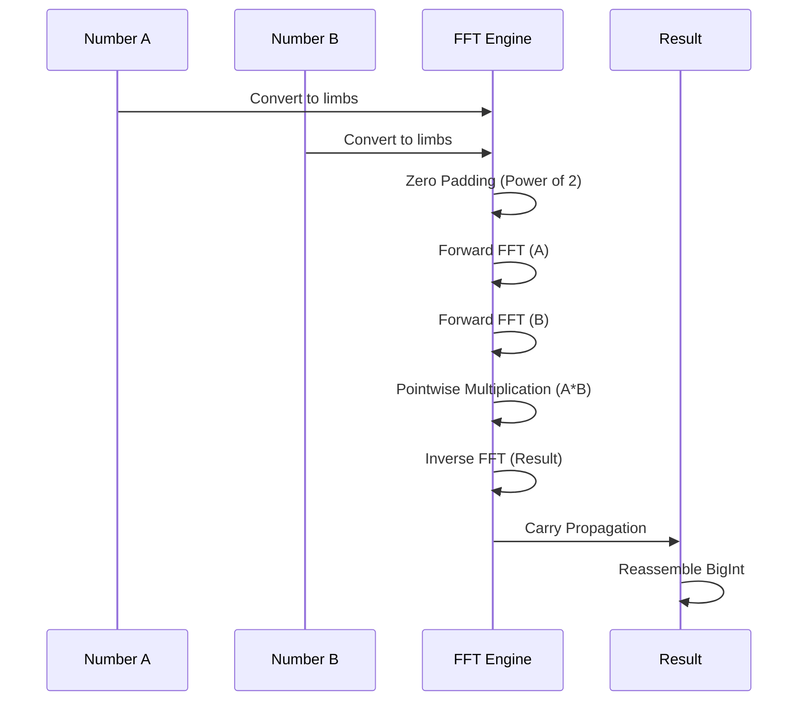

# FFT Multiplication for Large Integers

> **Complexity**: O(n log n) for multiplying two numbers of n bits
> **Used by**: Fast Doubling and Matrix Exp. for very large numbers

## Introduction

The **Fast Fourier Transform (FFT)** allows multiplying two large integers in O(n log n) instead of O(n^2) for naive multiplication or O(n^1.585) for Karatsuba. This optimization becomes crucial for numbers exceeding approximately 500,000 bits.

## Mathematical Principle

### Convolution and Multiplication

Multiplication of two integers can be viewed as a **convolution** of their digits:

```
A = Sum_i a_i * B^i
B = Sum_j b_j * B^j

A * B = Sum_k c_k * B^k  where  c_k = Sum_i a_i * b(k-i)
```

The term c_k is the **discrete convolution** of sequences {a_i} and {b_j}.

### Convolution Theorem

The convolution theorem states that:

```
DFT(a * b) = DFT(a) * DFT(b)  (pointwise multiplication)
```

Where `*` is convolution and DFT is the Discrete Fourier Transform.

Therefore:
```
a * b = IDFT(DFT(a) * DFT(b))
```

### Visualization



### FFT Multiplication Algorithm

1. **Padding**: Extend numbers to a power of 2 length
2. **DFT**: Compute FFT of both digit sequences
3. **Multiplication**: Multiply pointwise in the frequency domain
4. **IDFT**: Compute inverse FFT
5. **Carry Propagation**: Handle carries

## Implementation in FibCalc

### `internal/bigfft` Public API

```go
// Multiply two big.Int values using FFT
func Mul(x, y *big.Int) (res *big.Int, err error)

// Multiply with destination reuse
func MulTo(z, x, y *big.Int) (res *big.Int, err error)

// Optimized squaring (saves ~33% FFT computation)
func Sqr(x *big.Int) (res *big.Int, err error)

// Squaring with destination reuse
func SqrTo(z, x *big.Int) (res *big.Int, err error)

```

### 2-Tier Multiplication Selection

The `smartMultiply` function in `internal/fibonacci/fft.go` selects the optimal algorithm:

```go
func smartMultiply(z, x, y *big.Int, fftThreshold int) (*big.Int, error) {
    bx := x.BitLen()
    by := y.BitLen()

    // Tier 1: FFT — both operands > FFTThreshold
    if fftThreshold > 0 && bx > fftThreshold && by > fftThreshold {
        return bigfft.MulTo(z, x, y)
    }

    // Tier 2: Standard math/big (uses Karatsuba internally for large operands)
    return z.Mul(x, y), nil
}
```

### Code Structure

```
internal/bigfft/
+-- fft.go              # Public API: Mul, MulTo, Sqr, SqrTo
+-- fft_core.go         # Core FFT algorithm implementation
+-- fft_recursion.go    # Recursive FFT decomposition
+-- fft_poly.go         # Polynomial operations for FFT
+-- fft_cache.go        # FFT transform caching
+-- fermat.go           # Modular arithmetic (Fermat number ring)
+-- pool.go             # sync.Pool-based object pools with size classes
+-- allocator.go        # Memory allocator abstraction
+-- bump.go             # Bump allocator for batch allocations
+-- memory_est.go       # Memory estimation for pre-allocation
+-- scan.go             # Conversion between big.Int and FFT representation
+-- arith_amd64.go      # amd64 vector arithmetic wrappers
+-- arith_generic.go    # Non-amd64 vector arithmetic wrappers
+-- arith_decl.go       # go:linkname declarations to math/big internals
+-- cpu_amd64.go        # Runtime CPU feature detection
```

### Fermat FFT

The implementation uses a **Fermat FFT** operating in the ring Z/(2^k + 1):

- Roots of unity are powers of 2
- Multiplications become bit shifts
- More efficient than complex number FFT for integers

## Activation Threshold

### Configuration

The FFT threshold is configured via the `fibonacci.Options` struct:

```go
opts := fibonacci.Options{
    FFTThreshold: 500_000,  // Default: 500,000 bits
}
```

Setting `FFTThreshold` to 0 disables FFT multiplication entirely.

### Threshold Selection

The optimal threshold depends on several factors:

| Factor | Impact |
|--------|--------|
| L3 cache size | Larger cache -> lower threshold |
| CPU frequency | Faster -> slightly higher threshold |
| Number of cores | More cores -> FFT less advantageous (saturating) |

The calibration system (`internal/calibration`) can determine optimal thresholds for your hardware programmatically.

## Interaction with Parallelism

### Contention Problem

The FFT algorithm tends to **saturate CPU resources** as it performs many parallel memory operations internally. Running multiple FFT multiplications in parallel causes contention.

### Implemented Solution

The `DoublingFramework` disables external parallelism when FFT is active, except for very large numbers:

```go
// Disable external parallelism when FFT is used
// except for very very large numbers
if opts.FFTThreshold > 0 {
    minBitLen := s.FK.BitLen()
    if minBitLen > opts.FFTThreshold {
        // FFT will be used - disable parallelism
        // except if numbers > ParallelFFTThreshold (5M bits)
        return minBitLen > ParallelFFTThreshold
    }
}
```

## FFT-Based Calculator

The `"fft"` calculator uses the `DoublingFramework` with an `FFTOnlyStrategy`:

```go
type FFTBasedCalculator struct{}

func (c *FFTBasedCalculator) Name() string {
    return "FFT-Based Doubling"
}

func (c *FFTBasedCalculator) CalculateCore(ctx context.Context, reporter ProgressCallback,
    n uint64, opts Options) (*big.Int, error) {
    s := AcquireState()
    defer ReleaseState(s)

    strategy := &FFTOnlyStrategy{}
    framework := NewDoublingFramework(strategy)
    return framework.ExecuteDoublingLoop(ctx, reporter, n, opts, s, false)
}
```

This calculator is primarily used for:
- FFT performance benchmarking
- Regression testing
- Multiplication algorithm comparison

## Complexity Analysis

### Multiplication of two numbers of n bits

| Algorithm | Complexity | Hidden constant |
|-----------|------------|-----------------|
| Naive | O(n^2) | Low |
| Karatsuba | O(n^1.585) | Medium |
| Toom-Cook 3 | O(n^1.465) | High |
| FFT | O(n log n) | Very high |

### Crossover Point

```
                    |
    Calculation     |     /
     time           |    /  <- Karatsuba O(n^1.585)
                    |   /
                    |  /
                    | /          <- FFT O(n log n)
                    |/     _______
                    +------------------
                          ~1M bits      Size (bits)
```

### FFT Overhead

FFT overhead comes from:
1. Conversion big.Int -> FFT representation
2. Padding to next power of 2
3. Forward and inverse FFT
4. Carry propagation

## Usage

### Go API

```go
factory := fibonacci.GlobalFactory()
calc, _ := factory.Get("fft")
result, _ := calc.Calculate(ctx, progressChan, 0, 100_000_000, fibonacci.Options{})
```

### Benchmarks

```bash
# Benchmark FFT-based calculator
go test -bench=BenchmarkFFT -benchmem ./internal/fibonacci/

# Benchmark bigfft package directly
go test -bench=. -benchmem ./internal/bigfft/
```

## References

1. Cooley, J. W., & Tukey, J. W. (1965). "An algorithm for the machine calculation of complex Fourier series". *Mathematics of Computation*.
2. Schonhage, A., & Strassen, V. (1971). "Schnelle Multiplikation grosser Zahlen". *Computing*.
3. [GMP Library - FFT Multiplication](https://gmplib.org/manual/FFT-Multiplication)
