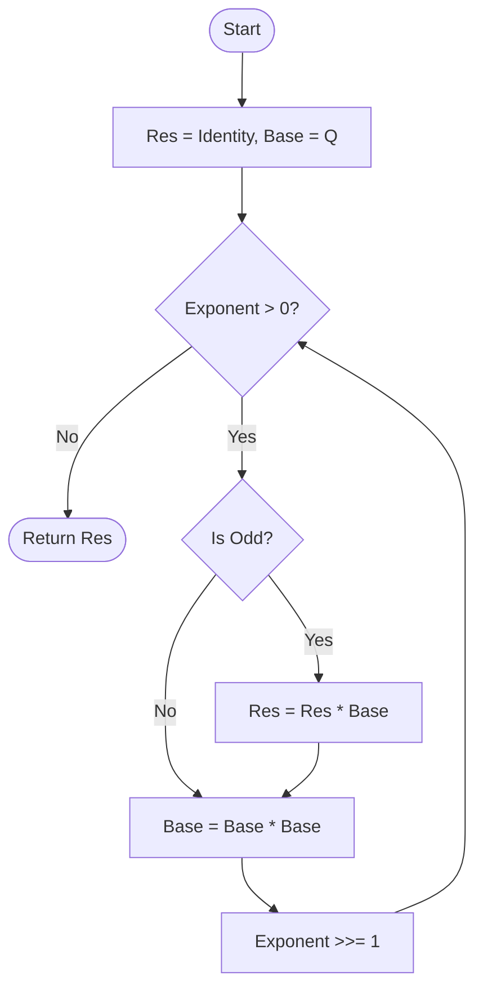
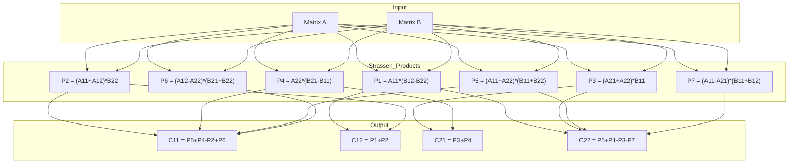

# Matrix Exponentiation

> **Complexity**: O(log n) matrix operations
> **Actual Complexity**: O(log n * M(n)) where M(n) is the multiplication cost

## Introduction

**Matrix exponentiation** is an elegant method for calculating Fibonacci numbers based on the matrix representation of the sequence. This approach exploits fast exponentiation (squaring) to reduce the number of operations to O(log n).

## Mathematical Foundation

### Fibonacci Q Matrix

The Fibonacci sequence satisfies the matrix relation:

```
[ F(n+1) ]   [ 1  1 ]   [ F(n)   ]
[        ] = [      ] * [        ]
[ F(n)   ]   [ 1  0 ]   [ F(n-1) ]
```

Applying this relation n times from initial conditions F(1) = 1, F(0) = 0:

```
[ F(n+1)  F(n)   ]   [ 1  1 ]^n
[                ] = [      ]
[ F(n)    F(n-1) ]   [ 1  0 ]
```

The matrix `Q = [[1,1], [1,0]]` is called the **Fibonacci Q matrix**.

### Formal Proof of Q-matrix Power Property

We prove by induction that Q^n has F(n+1), F(n), F(n), F(n-1) as its elements.

**Base Case (n=1)**:
$$ Q^1 = \begin{pmatrix} 1 & 1 \\ 1 & 0 \end{pmatrix} = \begin{pmatrix} F_2 & F_1 \\ F_1 & F_0 \end{pmatrix} $$
Since F(2)=1, F(1)=1, F(0)=0, the base case holds.

**Inductive Step**:
Assume the property holds for k: Q^k has elements F(k+1), F(k), F(k), F(k-1).
We want to show it holds for k+1.

$$ Q^{k+1} = Q^k \times Q = \begin{pmatrix} F_{k+1} & F_k \\ F_k & F_{k-1} \end{pmatrix} \times \begin{pmatrix} 1 & 1 \\ 1 & 0 \end{pmatrix} $$

Performing the multiplication:
$$ Q^{k+1} = \begin{pmatrix} F_{k+1} + F_k & F_{k+1} \\ F_k + F_{k-1} & F_k \end{pmatrix} $$

Using the Fibonacci recurrence F(m) = F(m-1) + F(m-2):
- Top-left: F(k+1) + F(k) = F(k+2)
- Top-right: F(k+1)
- Bottom-left: F(k) + F(k-1) = F(k+1)
- Bottom-right: F(k)

This matches the formula for n=k+1. The property holds for all n >= 1.

### Properties of Q

1. **Determinant**: det(Q^n) = (-1)^n
2. **Symmetry**: Q^n is always a symmetric matrix (Q^n[0][1] = Q^n[1][0])
3. **Cassini's Identity**: F(n+1)*F(n-1) - F(n)^2 = (-1)^n

## Algorithm

### Fast Exponentiation (Binary Exponentiation)

The key idea is to use binary decomposition of the exponent:

```
n = Sum b_i * 2^i  (where b_i in {0, 1})
```

Then:
```
Q^n = Q^(Sum b_i * 2^i) = Product Q^(b_i * 2^i)
```

### Visualization



### Pseudocode

```
MatrixFibonacci(n):
    if n == 0:
        return 0

    result = identity matrix I
    base = Q = [[1,1], [1,0]]

    exponent = n - 1

    while exponent > 0:
        if exponent is odd:
            result = result * base
        base = base * base  // Squaring
        exponent = exponent / 2

    return result[0][0]  // This is F(n)
```

### Go Implementation

The implementation uses the `MatrixFramework` to encapsulate the exponentiation loop:

```go
type MatrixExponentiation struct{}

func (c *MatrixExponentiation) Name() string {
    return "Matrix Exponentiation (O(log n), Parallel, Zero-Alloc)"
}

func (c *MatrixExponentiation) CalculateCore(ctx context.Context, reporter ProgressCallback,
    n uint64, opts Options) (*big.Int, error) {
    state := acquireMatrixState()
    defer releaseMatrixState(state)

    framework := NewMatrixFramework()
    return framework.ExecuteMatrixLoop(ctx, reporter, n, opts, state)
}
```

The `matrix` type (defined in `matrix_types.go`) represents a 2x2 matrix:

```go
type matrix struct{ a, b, c, d *big.Int }
// Layout: [ a b ]
//         [ c d ]
```

## Implemented Optimizations

### 1. Strassen Algorithm

For 2x2 matrices with large elements, the Strassen algorithm reduces the number of multiplications from 8 to 7:

```
Classic 2x2 multiplication:
  C[0][0] = A[0][0]*B[0][0] + A[0][1]*B[1][0]  (2 mult)
  C[0][1] = A[0][0]*B[0][1] + A[0][1]*B[1][1]  (2 mult)
  C[1][0] = A[1][0]*B[0][0] + A[1][1]*B[1][0]  (2 mult)
  C[1][1] = A[1][0]*B[0][1] + A[1][1]*B[1][1]  (2 mult)
  Total: 8 multiplications

Strassen 2x2:
  P1 = A[0][0] * (B[0][1] - B[1][1])
  P2 = (A[0][0] + A[0][1]) * B[1][1]
  P3 = (A[1][0] + A[1][1]) * B[0][0]
  P4 = A[1][1] * (B[1][0] - B[0][0])
  P5 = (A[0][0] + A[1][1]) * (B[0][0] + B[1][1])
  P6 = (A[0][1] - A[1][1]) * (B[1][0] + B[1][1])
  P7 = (A[0][0] - A[1][0]) * (B[0][0] + B[0][1])

  C[0][0] = P5 + P4 - P2 + P6
  C[0][1] = P1 + P2
  C[1][0] = P3 + P4
  C[1][1] = P5 + P1 - P3 - P7
  Total: 7 multiplications + 18 additions
```

**Strassen Decomposition Diagram**:



The implementation switches to Strassen when elements exceed `StrassenThreshold` (default: 3072 bits via config; internal default is 256 bits).

### 2. Symmetric Matrix Squaring

Since the Fibonacci Q-matrix powers are always symmetric (b = c), squaring can be done with only 4 multiplications instead of 8:

```
[ a  b ]^2   [ a^2+b^2    b(a+d) ]
[      ]   = [                    ]
[ b  d ]     [ b(a+d)     b^2+d^2 ]
```

The `squareSymmetricMatrix` function in `matrix_ops.go` implements this optimization.

### 3. Zero-Allocation with sync.Pool

Matrix states are recycled via a `sync.Pool`:

```go
type matrixState struct {
    res, p, tempMatrix *matrix
    // Temporaries for Strassen (p1-p7, s1-s10)
    // Temporaries for symmetric square (t1-t5)
}
```

### 4. Parallelism

Independent multiplications within Strassen's algorithm (P1-P7) can be parallelized when operands exceed the `ParallelThreshold`.

## Complexity Analysis

### Operations per Iteration

| Operation | Classic | Strassen | Symmetric Square |
|-----------|---------|----------|------------------|
| Multiplications | 8 | 7 | 4 |
| Additions | 4 | 18 | 4 |

### Number of Iterations

- log2(n) iterations
- At each iteration: 1 squaring + potentially 1 multiplication

### Total Complexity

- **With Karatsuba**: O(log n * n^1.585)
- **With FFT**: O(log n * n log n)

## Comparison with Fast Doubling

| Criterion | Matrix Exp. | Fast Doubling |
|-----------|-------------|---------------|
| Multiplications/iter (base) | 8 | 3 |
| Multiplications/iter (optimized) | 4-7 | 3 |
| Mathematical complexity | More intuitive | More compact |
| Practical performance | Slower | Faster |

## Usage

### Go API

```go
factory := fibonacci.GlobalFactory()
calc, _ := factory.Get("matrix")
result, _ := calc.Calculate(ctx, progressChan, 0, n, fibonacci.Options{
    StrassenThreshold: 3072,
})
```

### Benchmarks

```bash
# Run Matrix Exponentiation benchmarks
go test -bench=BenchmarkMatrix -benchmem ./internal/fibonacci/

# Compare with Fast Doubling
go test -bench='Benchmark(FastDoubling|Matrix)' -benchmem ./internal/fibonacci/
```

## References

1. Erickson, J. (2019). *Algorithms*. Chapter on Recursion and Backtracking.
2. Cormen, T. H. et al. (2009). *Introduction to Algorithms*. Section 31.2: Matrix Exponentiation.
3. Strassen, V. (1969). "Gaussian Elimination is not Optimal". *Numerische Mathematik*.
