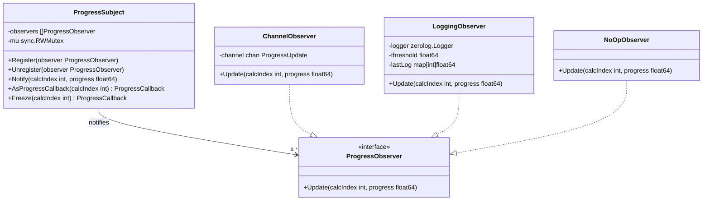
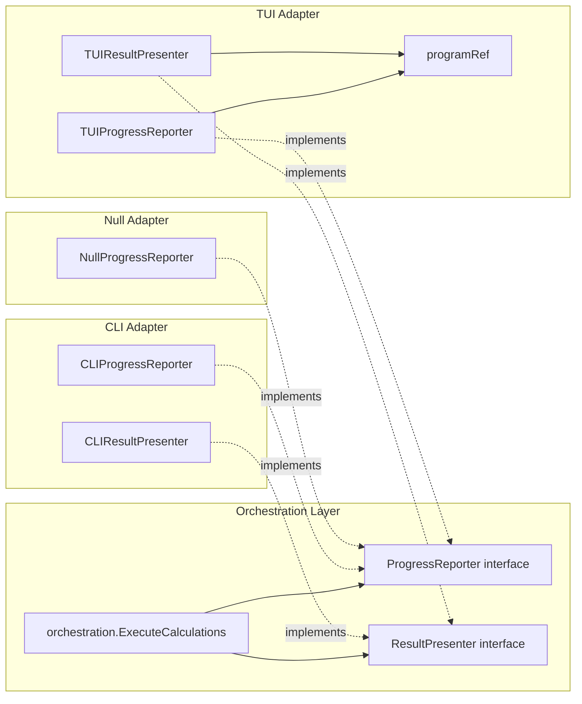

# Design Patterns

This document catalogs the twelve design patterns used in the FibGo codebase,
their motivations, key types, source locations, and how they interact during
a calculation.

For architectural context and ADRs, see [Architecture](../README.md).

---

## Table of Contents

1. [Observer Pattern](#1-observer-pattern)
2. [Strategy Pattern (with ISP)](#2-strategy-pattern-with-isp)
3. [Factory + Registry Pattern](#3-factory--registry-pattern)
4. [Decorator Pattern](#4-decorator-pattern)
5. [Framework Pattern](#5-framework-pattern)
6. [Interface-Based Decoupling (Ports and Adapters)](#6-interface-based-decoupling-ports-and-adapters)
7. [Object Pooling](#7-object-pooling)
8. [Bump Allocator](#8-bump-allocator)
9. [FFT Transform Cache](#9-fft-transform-cache)
10. [Dynamic Threshold Adjustment](#10-dynamic-threshold-adjustment)
11. [Zero-Copy Result Return](#11-zero-copy-result-return)
12. [Generics with Pointer Constraint](#12-generics-with-pointer-constraint)
13. [Pattern Interactions](#13-pattern-interactions)
14. [Quick Reference](#14-quick-reference)

---

## 1. Observer Pattern

**Location**: `internal/fibonacci/observer.go`, `internal/fibonacci/observers.go`

The Observer pattern decouples Fibonacci algorithm implementations from their progress
consumers. A `ProgressSubject` maintains a list of `ProgressObserver` instances and
notifies them synchronously whenever calculation progress changes.

### Interface

```go
// internal/fibonacci/observer.go

type ProgressObserver interface {
    Update(calcIndex int, progress float64)
}
```

### Subject

```go
// internal/fibonacci/observer.go

type ProgressSubject struct {
    observers []ProgressObserver
    mu        sync.RWMutex
}
```

Key methods:

| Method | Description |
|--------|-------------|
| `Register(observer)` | Adds an observer. Nil observers are ignored. |
| `Unregister(observer)` | Removes an observer by identity comparison. |
| `Notify(calcIndex, progress)` | Notifies all observers under a read lock. |
| `AsProgressCallback(calcIndex)` | Returns a `ProgressCallback` closure that calls `Notify`. |
| `Freeze(calcIndex)` | Creates a lock-free snapshot of observers, returns a `ProgressCallback`. Used in hot loops. |

`AsProgressCallback` bridges the observer world to the functional `ProgressCallback`
type expected by `coreCalculator.CalculateCore()`, allowing algorithm code to
report progress without knowing about observers. `Freeze()` takes a snapshot of
the observer list so the callback can notify without acquiring any locks --
essential for performance-critical calculation loops.

### Concrete Observers

**ChannelObserver** (`observers.go`) -- adapts to channel-based communication for
backward compatibility with the orchestration layer's `progressChan`:

```go
// internal/fibonacci/observers.go

func (o *ChannelObserver) Update(calcIndex int, progress float64) {
    // ...
    select {
    case o.channel <- update:
    default:
        // Channel full, drop update (UI will catch up on next update)
    }
}
```

The non-blocking send prevents deadlocks when the UI consumer is slower than the
calculator producer.

**LoggingObserver** (`observers.go`) -- throttled zerolog logging. Only logs when
the progress delta exceeds a configurable threshold (default 10%), preventing log spam
during fast calculations:

```go
// internal/fibonacci/observers.go

type LoggingObserver struct {
    logger    zerolog.Logger
    threshold float64
    lastLog   map[int]float64
    mu        sync.Mutex
}
```

**NoOpObserver** (`observers.go`) -- Null Object pattern. Discards all updates
silently. Used in tests and quiet mode where no progress display is needed.

### Class Diagram



---

## 2. Strategy Pattern (with ISP)

**Location**: `internal/fibonacci/strategy.go`

The Strategy pattern encapsulates multiplication algorithms behind a common interface,
allowing calculators to switch between standard math/big, FFT, or adaptive selection at runtime
without modifying their doubling-step logic.

For the 3-tier multiplication threshold system, see [../../algorithms/FFT.md](../../algorithms/FFT.md).

### Interfaces

The Strategy pattern applies the **Interface Segregation Principle (ISP)** with two levels,
ensuring consumers only depend on the methods they actually need:

```go
// internal/fibonacci/strategy.go

// Narrow interface: consumers that only need Multiply/Square
type Multiplier interface {
    Multiply(z, x, y *big.Int, opts Options) (*big.Int, error)
    Square(z, x *big.Int, opts Options) (*big.Int, error)
    Name() string
}

// Wide interface: adds doubling-step-aware execution
type DoublingStepExecutor interface {
    Multiplier
    ExecuteStep(ctx context.Context, s *CalculationState, opts Options, inParallel bool) error
}

// Deprecated: MultiplicationStrategy is a type alias for DoublingStepExecutor.
// New code should use Multiplier (for basic operations) or DoublingStepExecutor
// (for optimized doubling steps) directly.
type MultiplicationStrategy = DoublingStepExecutor
```

`ExecuteStep` is a specialized method that performs a complete fast-doubling step. This
allows strategies like `FFTOnlyStrategy` to reuse FFT transforms across the two
multiplications in a single step, avoiding redundant forward transforms. The `ctx`
parameter enables cancellation checking between multiplications.

### Concrete Strategies

| Strategy | Selection Logic | Use Case |
|----------|----------------|----------|
| `AdaptiveStrategy` | Delegates to `smartMultiply`/`smartSquare`, which select standard `math/big` or FFT based on operand bit length and `opts.FFTThreshold` | Default production strategy |
| `FFTOnlyStrategy` | Forces `mulFFT`/`sqrFFT` for every operation | Benchmarking FFT, very large N |
| `KaratsubaStrategy` | Forces `math/big.Mul` for every operation | Testing, small-N comparison |

> **Deprecation notice**: The `MultiplicationStrategy` type alias is deprecated. New code
> should depend on `Multiplier` (narrow, for consumers that only need `Multiply`/`Square`)
> or `DoublingStepExecutor` (wide, for consumers that need `ExecuteStep`). The alias is
> retained for backward compatibility but may be removed in a future version.

### AdaptiveStrategy Threshold Logic

```go
// internal/fibonacci/strategy.go

func (s *AdaptiveStrategy) ExecuteStep(ctx context.Context, state *CalculationState, opts Options, inParallel bool) error {
    if opts.FFTThreshold > 0 && state.FK1.BitLen() > opts.FFTThreshold {
        return executeDoublingStepFFT(ctx, state, opts, inParallel)
    }
    return executeDoublingStepMultiplications(ctx, s, state, opts, inParallel)
}
```

When operand bits exceed `FFTThreshold`, the strategy switches to the FFT path with
transform reuse. Below that threshold, it falls back to standard doubling-step
multiplications that use standard `big.Mul`.

---

## 3. Factory + Registry Pattern

**Location**: `internal/fibonacci/registry.go`

The Factory + Registry pattern provides lazy creation and caching of `Calculator`
instances. A global singleton (`GlobalFactory()`) pre-registers the three built-in
algorithms and supports dynamic registration for optional backends like GMP.

### Interface

```go
// internal/fibonacci/registry.go

type CalculatorFactory interface {
    Create(name string) (Calculator, error)
    Get(name string) (Calculator, error)
    List() []string
    Register(name string, creator func() coreCalculator) error
    GetAll() map[string]Calculator
}
```

### DefaultFactory

```go
// internal/fibonacci/registry.go

type DefaultFactory struct {
    mu          sync.RWMutex
    creators    map[string]func() coreCalculator
    calculators map[string]Calculator
}
```

**Pre-registered algorithms** (in `NewDefaultFactory()`):

| Name | Creator | Algorithm |
|------|---------|-----------|
| `"fast"` | `func() coreCalculator { return &OptimizedFastDoubling{} }` | O(log n), parallel, zero-alloc |
| `"matrix"` | `func() coreCalculator { return &MatrixExponentiation{} }` | O(log n), parallel, Strassen |
| `"fft"` | `func() coreCalculator { return &FFTBasedCalculator{} }` | O(log n), FFT-accelerated |

### Double-Checked Locking in Get()

`Get()` uses a double-checked locking pattern to minimize lock contention during
concurrent access:

```go
// internal/fibonacci/registry.go

func (f *DefaultFactory) Get(name string) (Calculator, error) {
    // Check cache first with read lock
    f.mu.RLock()
    if calc, exists := f.calculators[name]; exists {
        f.mu.RUnlock()
        return calc, nil
    }
    f.mu.RUnlock()

    // Create new calculator with write lock
    f.mu.Lock()
    defer f.mu.Unlock()

    // Double-check after acquiring write lock
    if calc, exists := f.calculators[name]; exists {
        return calc, nil
    }
    // ... create and cache
}
```

### GMP Auto-Registration

When built with `-tags=gmp`, the `calculator_gmp.go` file's `init()` function
automatically registers a `"gmp"` calculator via `RegisterCalculator()`. No code
changes are needed in the factory -- the Go build tag system and the registry's
`Register()` method handle it transparently.

### Singleton Access

```go
var globalFactory = NewDefaultFactory()

func GlobalFactory() *DefaultFactory { return globalFactory }

func RegisterCalculator(name string, creator func() coreCalculator) error {
    return globalFactory.Register(name, creator)
}
```

---

## 4. Decorator Pattern

**Location**: `internal/fibonacci/calculator.go`

The Decorator pattern wraps raw algorithm implementations (`coreCalculator`) with
cross-cutting concerns without modifying the algorithm code. `FibCalculator` is the
sole decorator, adding four responsibilities on top of the core algorithm.

### Interfaces

```go
// internal/fibonacci/calculator.go

// Public interface consumed by orchestration
type Calculator interface {
    Calculate(ctx context.Context, progressChan chan<- ProgressUpdate,
        calcIndex int, n uint64, opts Options) (*big.Int, error)
    Name() string
}

// Internal interface for pure algorithm implementations
type coreCalculator interface {
    CalculateCore(ctx context.Context, reporter ProgressCallback,
        n uint64, opts Options) (*big.Int, error)
    Name() string
}
```

### FibCalculator Wrapping

```go
// internal/fibonacci/calculator.go

type FibCalculator struct {
    core coreCalculator
}
```

### Responsibilities Added by the Decorator

1. **Small-N fast path**: For `n <= 93` (the largest Fibonacci number fitting in a
   `uint64`), the decorator bypasses the core algorithm entirely and uses iterative
   addition.

2. **Observer bridging**: `Calculate()` creates a `ProgressSubject` with a
   `ChannelObserver`, then delegates to `CalculateWithObservers()`. This provides
   backward compatibility with channel-based progress reporting.

3. **FFT cache configuration**: Calls `configureFFTCache(opts)` to set cache
   parameters before the core algorithm runs.

4. **Pool pre-warming**: Calls `bigfft.EnsurePoolsWarmed(n)` to ensure memory pools
   are sized for the expected calculation before entering the hot loop.

```go
// internal/fibonacci/calculator.go

func (c *FibCalculator) CalculateWithObservers(ctx context.Context, subject *ProgressSubject,
    calcIndex int, n uint64, opts Options) (result *big.Int, err error) {
    // ...
    if n <= MaxFibUint64 {
        reporter(1.0)
        return calculateSmall(n), nil
    }
    configureFFTCache(opts)
    bigfft.EnsurePoolsWarmed(n)
    result, err = c.core.CalculateCore(ctx, reporter, n, opts)
    // ...
}
```

---

## 5. Framework Pattern

**Location**: `internal/fibonacci/doubling_framework.go`, `internal/fibonacci/matrix_framework.go`

The Framework pattern encapsulates the core algorithm loops, decoupled from
multiplication strategies. Each framework owns the iteration logic (bit scanning,
parallelization decisions, progress reporting) while delegating arithmetic to
pluggable strategies.

### DoublingFramework

**File**: `internal/fibonacci/doubling_framework.go:20`

```go
// internal/fibonacci/doubling_framework.go

type DoublingFramework struct {
    strategy         DoublingStepExecutor
    dynamicThreshold *DynamicThresholdManager
}
```

`DoublingFramework` encapsulates the Fast Doubling loop logic:
- Iterates MSB-to-LSB over the bits of `n`
- Delegates each doubling step to the pluggable `DoublingStepExecutor`
- Optionally integrates `DynamicThresholdManager` for runtime threshold adjustment
- Reports progress via `ProgressCallback` using the harmonized `ReportStepProgress()` utility

Created via:
- `NewDoublingFramework(strategy)` -- basic framework
- `NewDoublingFrameworkWithDynamicThresholds(strategy, dtm)` -- with dynamic adjustment

### MatrixFramework

**File**: `internal/fibonacci/matrix_framework.go:16`

```go
// internal/fibonacci/matrix_framework.go

type MatrixFramework struct{}
```

`MatrixFramework` encapsulates the Matrix Exponentiation loop:
- Binary exponentiation iterating LSB-to-MSB
- Symmetric matrix squaring with Strassen switching based on `StrassenThreshold`
- Parallel matrix multiplication when operand size exceeds `ParallelThreshold`
- Progress reporting via `CalcTotalWork()` and `PrecomputePowers4()`

Created via `NewMatrixFramework()`.

### Design Rationale

The Framework pattern separates two concerns:
1. **Loop control** (bit iteration order, cancellation checks, progress) -- owned by the framework
2. **Arithmetic** (multiply, square, FFT) -- owned by the strategy (see [Strategy Pattern](#2-strategy-pattern-with-isp))

This allows the same `DoublingStepExecutor` (e.g., `AdaptiveStrategy`) to be plugged
into different frameworks without code duplication.

---

## 6. Interface-Based Decoupling (Ports and Adapters)

**Location**: `internal/orchestration/interfaces.go`, `internal/cli/presenter.go`, `internal/tui/bridge.go`

The orchestration layer defines two interfaces that act as ports. The CLI and TUI
packages provide adapter implementations, ensuring that business logic never imports
presentation packages. This follows Clean Architecture principles (see
[Architecture](../README.md)).

### Interfaces (Ports)

```go
// internal/orchestration/interfaces.go

type ProgressReporter interface {
    DisplayProgress(wg *sync.WaitGroup, progressChan <-chan fibonacci.ProgressUpdate,
        numCalculators int, out io.Writer)
}

type ResultPresenter interface {
    PresentComparisonTable(results []CalculationResult, out io.Writer)
    PresentResult(result CalculationResult, n uint64, verbose, details, showValue bool, out io.Writer)
    FormatDuration(d time.Duration) string
    HandleError(err error, duration time.Duration, out io.Writer) int
}
```

### Adapters

| Adapter | Package | File | Mechanism |
|---------|---------|------|-----------|
| `CLIProgressReporter` | `internal/cli` | `presenter.go` | Delegates to spinner + progress bar display functions |
| `CLIResultPresenter` | `internal/cli` | `presenter.go` | Formats colorized output to `io.Writer` |
| `TUIProgressReporter` | `internal/tui` | `bridge.go` | Drains channel, sends `ProgressMsg` to Bubble Tea |
| `TUIResultPresenter` | `internal/tui` | `bridge.go` | Sends `ComparisonResultsMsg` / `FinalResultMsg` to Bubble Tea |
| `NullProgressReporter` | `internal/orchestration` | `interfaces.go` | Drains channel silently (quiet mode, testing) |

### TUI Bridge Detail

The TUI adapter uses a `programRef` struct to hold a pointer to the `*tea.Program`
that survives Bubble Tea model copies (Bubble Tea uses value semantics):

```go
// internal/tui/bridge.go

type programRef struct {
    program *tea.Program
}

func (r *programRef) Send(msg tea.Msg) {
    if r.program != nil {
        r.program.Send(msg)
    }
}
```

`tea.Program.Send()` is thread-safe, so the bridge goroutine (running
`DisplayProgress`) can send messages concurrently with the Bubble Tea event loop.

### Dependency Direction Diagram



Arrows point from dependant to dependency. Dashed arrows represent interface
implementation. The orchestration layer depends only on the interfaces it defines --
it never imports `cli` or `tui`.

---

## 7. Object Pooling

**Location**: `internal/fibonacci/common.go`, `internal/bigfft/pool.go`

Object pooling reduces GC pressure for the millions of temporary allocations generated
during large Fibonacci calculations. The project uses size-classed `sync.Pool` instances
with a cap on pooled object size.

For pool implementation details, see [../../algorithms/BIGFFT.md](../../algorithms/BIGFFT.md).

### sync.Pool Pools (`internal/bigfft/pool.go`)

All pools use size classes. Objects are acquired with `acquire*` and released with
`release*` functions (always paired with `defer`):

| Pool | Size Classes | Element Type |
|------|-------------|--------------|
| `wordSlicePools` | 10 classes: 64 to 16M words | `[]big.Word` |
| `fermatPools` | 9 classes: 32 to 2M | `fermat` |
| `natSlicePools` | 7 classes: 8 to 32K | `[]nat` |
| `fermatSlicePools` | 7 classes: 8 to 32K | `[]fermat` |
| `fftStatePool` | single | `*fftState` (bundles FFT temporaries) |

Example usage pattern:

```go
slice := acquireWordSlice(size)
defer releaseWordSlice(slice)
```

The `fftState` pool bundles all temporaries for a single FFT multiplication into one
object, reducing individual pool lookups:

```go
// internal/bigfft/pool.go

type fftState struct {
    tmp  fermat
    tmp2 fermat
    n    int
    k    uint
}
```

### Fibonacci Calculation State Pools

**File**: `internal/fibonacci/common.go:34-39`

`CalculationState` and `matrixState` pools in `internal/fibonacci/` recycle the
`big.Int` temporaries used during fast-doubling and matrix exponentiation steps.
A `MaxPooledBitLen` cap (100M bits, ~12.5 MB) prevents excessively large objects from being
retained in the pool:

```go
// internal/fibonacci/common.go

// MaxPooledBitLen is the maximum size (in bits) of a big.Int
// accepted into the pool. Larger objects are left for GC collection.
const MaxPooledBitLen = 100_000_000

func checkLimit(z *big.Int) bool {
    return z != nil && z.BitLen() > MaxPooledBitLen
}
```

This limit was increased from 4M to 100M to allow pooling of intermediate
results for large Fibonacci calculations (e.g., F(10^8)).

### Task Semaphore

**File**: `internal/fibonacci/common.go:18-32`

The task semaphore limits the number of concurrent goroutines for multiplication
and squaring tasks to `runtime.NumCPU() * 2`, preventing excessive goroutine creation:

```go
// internal/fibonacci/common.go

var taskSemaphore chan struct{}

func getTaskSemaphore() chan struct{} {
    taskSemaphoreOnce.Do(func() {
        taskSemaphore = make(chan struct{}, runtime.NumCPU()*2)
    })
    return taskSemaphore
}
```

---

## 8. Bump Allocator

**Location**: `internal/bigfft/bump.go`

For FFT operations that need many small, short-lived allocations released together,
the bump allocator provides O(1) allocation with zero fragmentation.

```go
// internal/bigfft/bump.go:27

type BumpAllocator struct {
    buffer []big.Word
    offset int
}
```

| Property | Value |
|----------|-------|
| Allocation cost | O(1) pointer bump |
| Fragmentation | Zero (contiguous memory) |
| Thread safety | NOT thread-safe (one per goroutine) |
| Lifecycle | `AcquireBumpAllocator` / `ReleaseBumpAllocator` via `sync.Pool` |
| Fallback | If capacity is exceeded, falls back to `make()` |

### Methods

The allocator offers four allocation methods covering all FFT temporary needs:

| Method | Description |
|--------|-------------|
| `Alloc(size)` | Allocate zeroed `[]big.Word` |
| `AllocUnsafe(size)` | Allocate unzeroed `[]big.Word` (caller must initialize) |
| `AllocFermat(size)` | Allocate a `fermat` value |
| `AllocFermatSlice(K, n)` | Allocate K `fermat` values of size n+1, returns `([]fermat, []big.Word)` |

### Capacity Estimation

`EstimateBumpCapacity(wordLen)` provides a heuristic for pre-sizing the buffer based
on FFT algorithm memory patterns (approximately `2 * K * (n+1)` for transforms plus
`8 * n` for multiply temporaries, with a 10% safety margin).

### Usage Pattern

```go
allocator := AcquireBumpAllocator(EstimateBumpCapacity(wordLen))
defer ReleaseBumpAllocator(allocator)

tmp := allocator.Alloc(size)
// use tmp...
// all allocations freed when allocator is released
```

---

## 9. FFT Transform Cache

**Location**: `internal/bigfft/fft_cache.go`

The FFT Transform Cache is a thread-safe LRU cache that stores forward FFT transform
results to avoid recomputation when the same operands are multiplied repeatedly.
This provides a 15-30% speedup for iterative algorithms.

### Configuration

```go
// internal/bigfft/fft_cache.go:19

type TransformCacheConfig struct {
    MaxEntries int  // Maximum cached transforms (default: 256)
    MinBitLen  int  // Minimum operand bit length to cache (default: 100000)
    Enabled    bool // Whether caching is active (default: true)
}
```

### Cache Implementation

```go
// internal/bigfft/fft_cache.go:54

type TransformCache struct {
    mu        sync.RWMutex
    config    TransformCacheConfig
    entries   map[uint64]*list.Element
    lru       *list.List
    hits      atomic.Uint64
    misses    atomic.Uint64
    evictions atomic.Uint64
}
```

Key design decisions:
- **FNV-1a hashing**: Much faster than SHA-256, sufficient collision resistance for cache keys
- **LRU eviction**: Least-recently-used entries are evicted when `MaxEntries` is reached
- **Atomic counters**: `hits`, `misses`, and `evictions` use `atomic.Uint64` for lock-free stats
- **Global singleton**: Accessed via `GetTransformCache()` with `sync.Once` initialization

### Configuration via Options

The cache is configured by the Decorator pattern (see [Decorator](#4-decorator-pattern)):
`FibCalculator.CalculateWithObservers()` calls `configureFFTCache(opts)` before
delegating to the core algorithm. Options flow from `fibonacci.Options.TransformCache*`
fields.

---

## 10. Dynamic Threshold Adjustment

**Location**: `internal/fibonacci/dynamic_threshold.go`, `internal/fibonacci/threshold_types.go`

The `DynamicThresholdManager` adjusts FFT and parallel thresholds at runtime based on
observed per-iteration timing metrics. This adapts to actual hardware performance
rather than relying solely on static configuration.

### Core Type

```go
// internal/fibonacci/dynamic_threshold.go:38

type DynamicThresholdManager struct {
    mu sync.RWMutex

    currentFFTThreshold      int
    currentParallelThreshold int
    originalFFTThreshold      int
    originalParallelThreshold int

    // Ring buffer of IterationMetric records
    metrics      [MaxMetricsHistory]IterationMetric
    metricsCount int
    metricsHead  int

    iterationCount     int
    adjustmentInterval int
    lastAdjustment     time.Time
}
```

### Constants

| Constant | Value | Purpose |
|----------|-------|---------|
| `DynamicAdjustmentInterval` | 5 | Iterations between threshold checks |
| `MinMetricsForAdjustment` | 3 | Minimum metrics before adjusting |
| `MaxMetricsHistory` | 20 | Ring buffer size |
| `FFTSpeedupThreshold` | 1.2 | Minimum speedup ratio to switch to FFT |
| `ParallelSpeedupThreshold` | 1.1 | Minimum speedup to enable parallelism |
| `HysteresisMargin` | 0.15 | Prevents oscillation between modes |

### Design Rationale

- **Ring buffer**: Fixed-size array of `IterationMetric` records avoids allocation;
  O(1) insertion with wrap-around
- **Hysteresis**: Thresholds must change by at least `HysteresisMargin` (15%) to trigger
  adjustment, preventing oscillation between FFT and standard multiplication modes
- **Separate analysis**: FFT and parallel thresholds are analyzed independently, as they
  respond to different performance characteristics

### Integration

The `DoublingFramework` accepts an optional `DynamicThresholdManager` via
`NewDoublingFrameworkWithDynamicThresholds()`. During each iteration, the framework
records timing metrics and queries the manager for updated thresholds.

---

## 11. Zero-Copy Result Return

**Location**: `internal/fibonacci/doubling_framework.go:273-280`, `internal/fibonacci/matrix_framework.go:86-92`

Both frameworks use a "steal" technique to return the result without an O(n) copy.
Instead of copying the result `big.Int` out of the pooled state, the code takes ownership
of the pointer and replaces it with a fresh empty `big.Int` so the state remains valid
for pool return.

### DoublingFramework

```go
// internal/fibonacci/doubling_framework.go:273-280

// Optimization: Avoid copying the entire result by "stealing" FK from the
// calculation state. We replace FK with a fresh empty big.Int so the state
// remains valid for pool return via ReleaseState.
result := s.FK
s.FK = new(big.Int)
return result, nil
```

### MatrixFramework

```go
// internal/fibonacci/matrix_framework.go:86-92

// Optimization: Avoid copying the entire result by "stealing" res.a from
// the matrix state. We replace it with a fresh empty big.Int so the state
// remains valid for pool return via releaseMatrixState.
result := state.res.a
state.res.a = new(big.Int)
return result, nil
```

### Cost Analysis

This eliminates an O(n) copy where n is the word count of the result. For example,
F(10M) has ~109K words (~850 KB). The technique trades this copy for a single
24-byte `big.Int` header allocation.

---

## 12. Generics with Pointer Constraint

**Location**: `internal/fibonacci/common.go:119-146`

The `executeTasks` function uses Go generics with a pointer constraint pattern to
eliminate code duplication between multiplication and squaring task execution.

### Generic Function

```go
// internal/fibonacci/common.go:119

func executeTasks[T any, PT interface {
    *T
    task
}](tasks []T, inParallel bool) error {
    if inParallel {
        sem := getTaskSemaphore()
        var wg sync.WaitGroup
        var ec parallel.ErrorCollector
        wg.Add(len(tasks))
        for i := range tasks {
            go func(t PT) {
                defer wg.Done()
                sem <- struct{}{}
                defer func() { <-sem }()
                ec.SetError(t.execute())
            }(PT(&tasks[i]))
        }
        wg.Wait()
        return ec.Err()
    }
    for i := range tasks {
        if err := PT(&tasks[i]).execute(); err != nil {
            return err
        }
    }
    return nil
}
```

### Type Constraint Pattern

The `PT interface { *T; task }` constraint means:
- `PT` must be a pointer to `T`
- `PT` must implement the `task` interface (method `execute() error`)

This allows the function to accept slices of value types (`[]multiplicationTask`
or `[]squaringTask`) while calling interface methods through the pointer type,
avoiding interface boxing overhead.

### Concrete Task Types

```go
// internal/fibonacci/common.go

type task interface {
    execute() error
}

type multiplicationTask struct {
    dest         **big.Int
    a, b         *big.Int
    fftThreshold int
}

type squaringTask struct {
    dest         **big.Int
    x            *big.Int
    fftThreshold int
}
```

Both implement `task` via pointer receivers, satisfying the `PT` constraint.

---

## 13. Pattern Interactions

During a single `Calculate()` call, all patterns cooperate in a layered call chain:

```
Calculate()                                   [Decorator]
  |
  +-- ProgressSubject.Register(ChannelObserver) [Observer]
  |
  +-- CalculateWithObservers()                  [Decorator]
       |
       +-- calculateSmall(n) if n <= 93         [Decorator: fast path]
       |
       +-- configureFFTCache(opts)              [FFT Transform Cache]
       |
       +-- bigfft.EnsurePoolsWarmed(n)          [Object Pooling]
       |
       +-- core.CalculateCore()                 [Decorator -> coreCalculator]
            |
            +-- DoublingFramework.ExecuteDoublingLoop()  [Framework]
            |    |
            |    +-- DynamicThresholdManager.Record()    [Dynamic Threshold]
            |    |
            |    +-- strategy.ExecuteStep()              [Strategy]
            |    |    |
            |    |    +-- smartMultiply / mulFFT         [Strategy: algorithm selection]
            |    |         |
            |    |         +-- acquireWordSlice()        [Object Pooling]
            |    |         +-- AcquireBumpAllocator()    [Bump Allocator]
            |    |         +-- TransformCache.Get()      [FFT Transform Cache]
            |    |
            |    +-- executeTasks[T, PT]()               [Generics]
            |    |
            |    +-- result := s.FK; s.FK = new(big.Int) [Zero-Copy Result]
            |
            +-- reporter(progress)                      [Observer: via Freeze()]
                 |
                 +-- subject.Notify()                   [Observer]
                      |
                      +-- ChannelObserver.Update() -> progressChan
                      +-- LoggingObserver.Update() -> zerolog
```

The Factory + Registry pattern operates at a higher level -- it creates the
`FibCalculator` (decorator wrapping a `coreCalculator`) before `Calculate()` is ever
called. The Interface-Based Decoupling pattern operates at the orchestration level,
where `ProgressReporter.DisplayProgress()` consumes the `progressChan` that the
`ChannelObserver` writes to.

### End-to-End Data Flow

```
CalculatorFactory.Get("fast")           -- Factory creates FibCalculator(OptimizedFastDoubling)
  |
orchestration.ExecuteCalculations()     -- Orchestration calls Calculator.Calculate()
  |
FibCalculator.Calculate()               -- Decorator creates Subject + ChannelObserver
  |
FibCalculator.CalculateWithObservers()  -- Decorator: fast path, cache config, pool warming
  |
DoublingFramework.ExecuteDoublingLoop() -- Framework: bit iteration, parallelization
  |
AdaptiveStrategy.ExecuteStep()          -- Strategy selects FFT or math/big
  |
executeTasks[T, PT](tasks, inParallel)  -- Generics: parallel/sequential task dispatch
  |
ProgressSubject.Notify()                -- Observer forwards progress
  |
ChannelObserver -> progressChan         -- Channel bridges to orchestration layer
  |
CLIProgressReporter.DisplayProgress()   -- Interface adapter consumes channel
```

---

## 14. Quick Reference

| # | Pattern | Location | Key Types | Purpose |
|---|---------|----------|-----------|---------|
| 1 | Observer | `internal/fibonacci/observer.go`, `observers.go` | `ProgressObserver`, `ProgressSubject` (with `Freeze()`), `ChannelObserver`, `LoggingObserver`, `NoOpObserver` | Decouple algorithms from progress consumers |
| 2 | Strategy + ISP | `internal/fibonacci/strategy.go` | `Multiplier` (narrow), `DoublingStepExecutor` (wide), `AdaptiveStrategy`, `FFTOnlyStrategy`, `KaratsubaStrategy` | Swap multiplication algorithms; ISP for minimal dependencies |
| 3 | Factory + Registry | `internal/fibonacci/registry.go` | `CalculatorFactory`, `DefaultFactory`, `GlobalFactory()` | Lazy creation, caching, dynamic registration of calculators |
| 4 | Decorator | `internal/fibonacci/calculator.go` | `Calculator`, `coreCalculator`, `FibCalculator` | Add small-N fast path, observer bridging, pool warming |
| 5 | Framework | `internal/fibonacci/doubling_framework.go`, `matrix_framework.go` | `DoublingFramework`, `MatrixFramework` | Encapsulate algorithm loops, decouple from strategies |
| 6 | Ports and Adapters | `internal/orchestration/interfaces.go`, `internal/cli/presenter.go`, `internal/tui/bridge.go` | `ProgressReporter`, `ResultPresenter`, `CLIProgressReporter`, `TUIProgressReporter`, `programRef` | Decouple orchestration from CLI/TUI presentation |
| 7 | Object Pooling | `internal/fibonacci/common.go`, `internal/bigfft/pool.go` | `MaxPooledBitLen`, `wordSlicePools`, `fermatPools`, `fftState`, task semaphore | Reduce GC pressure via size-classed `sync.Pool` |
| 8 | Bump Allocator | `internal/bigfft/bump.go` | `BumpAllocator`, `AcquireBumpAllocator`, `EstimateBumpCapacity` | O(1) allocation for FFT temporaries |
| 9 | FFT Transform Cache | `internal/bigfft/fft_cache.go` | `TransformCache`, `TransformCacheConfig`, `GetTransformCache()` | LRU cache for FFT transforms (15-30% speedup) |
| 10 | Dynamic Threshold | `internal/fibonacci/dynamic_threshold.go` | `DynamicThresholdManager`, `IterationMetric` | Runtime FFT/parallel threshold adjustment with hysteresis |
| 11 | Zero-Copy Result | `internal/fibonacci/doubling_framework.go:273`, `matrix_framework.go:86` | pointer swap technique | Avoid O(n) result copy from pooled state |
| 12 | Generics | `internal/fibonacci/common.go:119` | `executeTasks[T, PT]()`, `task`, `multiplicationTask`, `squaringTask` | Eliminate task execution duplication via pointer constraint |
