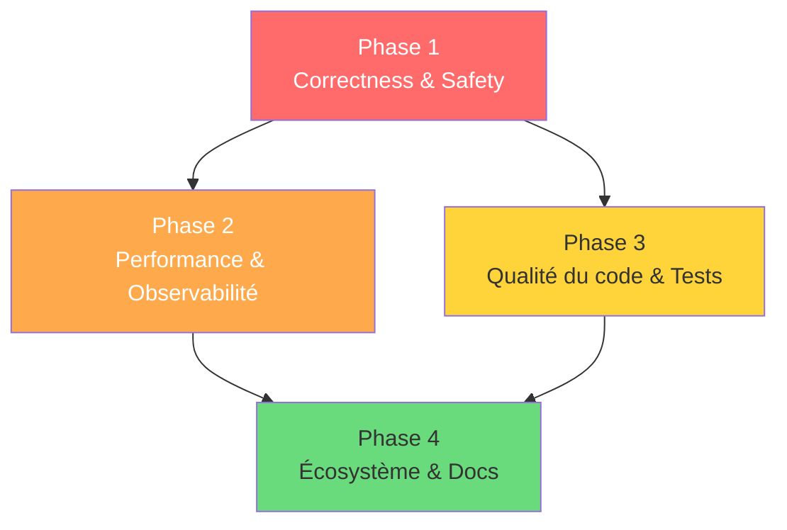

# IMPROVEPLAN.md — Plan d'amélioration structuré pour FibGo

> Dérivé de l'analyse de [`IMPROVE.md`](file:///c:/Users/agbru/OneDrive/Documents/GitHub/FibGo/IMPROVE.md).
> Organise les ~40 items d'amélioration en **4 phases** ordonnées par criticité, dépendances et valeur ajoutée.

---

## Vue d'ensemble des phases

| Phase | Thème | Priorité | Effort estimé | Items |
|-------|-------|----------|---------------|-------|
| **1** | Correctness, Safety & Concurrency | 🔴 Haute | Moyen-élevé | 10 |
| **2** | Performance & Observabilité | 🟠 Moyenne-haute | Moyen | 8 |
| **3** | Qualité du code & Testabilité | 🟡 Moyenne | Moyen | 10 |
| **4** | Écosystème, Docs & Outillage | 🟢 Basse | Faible-moyen | 12 |

---

## Phase 1 — Correctness, Safety & Concurrency

> **Objectif** : Éliminer les risques de race conditions, de dépassement de ressources et les lacunes dans la gestion des erreurs.

### 1.1 Unifier le budget de concurrence (IMPROVE §6.1)

- [ ] Concevoir un coordinateur centralisé de concurrence pour harmoniser :
  - Sémaphore fibonacci (`internal/fibonacci/common.go` → `taskSemaphore`)
  - Parallélisme FFT (`internal/bigfft/fft_recursion.go`)
  - Fan-out orchestration (`internal/orchestration/orchestrator.go`)
- [ ] Exposer des paramètres de réglage avancé (`--max-goroutines`, etc.)
- **Fichiers impactés** : `internal/fibonacci/common.go`, `internal/bigfft/fft_recursion.go`, `internal/orchestration/orchestrator.go`, `internal/config/config.go`

### 1.2 Renforcer la propagation de l'annulation (IMPROVE §5.4, §6.3)

- [ ] Auditer la chaîne `context.Context` de `Application.Run` → calculateurs → boucle doubling → opérations FFT
- [ ] Ajouter un signal d'annulation dans `executeParallel3` pour arrêter les pairs en cas d'échec
- [ ] Documenter et tester la sémantique d'annulation bout en bout
- **Fichiers impactés** : `internal/fibonacci/doubling_framework.go`, `internal/fibonacci/common.go`, `internal/app/app.go`

### 1.3 Ajouter des gardes-fous contre l'abus de ressources (IMPROVE §8.1)

- [ ] Implémenter un cap optionnel sur `n` (ou confirmation obligatoire au-delà d'un seuil)
- [ ] Renforcer l'application du budget mémoire au-delà des simple avertissements
- **Fichiers impactés** : `internal/config/config.go`, `internal/app/calculate.go`

### 1.4 Tests de fault-injection pour les frontières panico/erreur (IMPROVE §3.3)

- [ ] Ajouter des tests pour panic dans un calculateur au sein de `errgroup`
- [ ] Codifier la politique : recover + report vs crash
- **Fichiers impactés** : `internal/orchestration/orchestrator.go` (+ fichiers de test)

### 1.5 Backpressure robuste sur le canal de progression (IMPROVE §6.2)

- [ ] Ajouter un comportement défensif si le consommateur du `progressChan` échoue ou termine prématurément
- [ ] Implémenter des écritures de progression non-bloquantes sensibles au contexte
- **Fichiers impactés** : `internal/orchestration/orchestrator.go`, `internal/progress/`

### 1.6 Sécuriser la gestion des chemins de fichiers (IMPROVE §8.2)

- [ ] Normaliser et valider les chemins de sortie/profil
- [ ] Améliorer les messages d'erreur pour les cas limites de permissions/traversal
- **Fichiers impactés** : `internal/calibration/profile.go`, `internal/calibration/io.go`, `internal/cli/output.go`

### 1.7 Contexte d'erreur enrichi pour les exécutions orchestrées (IMPROVE §5.1)

- [ ] Encapsuler les erreurs avec le nom/index du calculateur de manière cohérente
- [ ] Préserver la chaîne de cause racine
- **Fichiers impactés** : `internal/orchestration/orchestrator.go`

### 1.8 Standardiser les messages d'erreur utilisateur vs internes (IMPROVE §5.2)

- [ ] Acheminer tous les chemins de commande via une stratégie de formatage unique
- [ ] Ajouter des indices de remédiation pour `MemoryError`, conflits de config
- **Fichiers impactés** : `internal/errors/errors.go`, `internal/errors/handler.go`

### 1.9 Multi-erreurs dans la validation de config (IMPROVE §5.3)

- [ ] Supporter l'accumulation de plusieurs problèmes de validation et les afficher ensemble
- **Fichiers impactés** : `internal/config/config.go`

### 1.10 Documenter les contrats de thread-safety (IMPROVE §6.4)

- [ ] Renforcer les contrats via des patterns lint/test
- [ ] Ajouter des commentaires renforcés aux sites d'appel critiques
- **Fichiers impactés** : `internal/parallel/errors.go`, `internal/bigfft/fft_cache.go`

---

## Phase 2 — Performance & Observabilité

> **Objectif** : Optimiser les chemins chauds et améliorer la visibilité sur le comportement runtime.

### 2.1 Réduire le surcoût par itération dans la boucle fast doubling (IMPROVE §2.1)

- [ ] Benchmarker `ctx.Err()` tous les N itérations vs chaque itération
- [ ] Gating conditionnel du reporting coûteux sous des seuils de delta de progression
- **Fichiers impactés** : `internal/fibonacci/doubling_framework.go`

### 2.2 Réduire les allocations transitoires dans le chemin de progression (IMPROVE §2.2)

- [ ] Précalculer les tables statiques pour les plages de bits bornées
- [ ] Profiler les allocations avec `pprof` pour de grands `n`
- **Fichiers impactés** : `internal/fibonacci/doubling_framework.go`

### 2.3 Optimiser les primitives d'exécution parallèle (IMPROVE §2.3)

- [ ] Comparer le modèle semaphore actuel contre un modèle de workers fixes
- [ ] Ajouter des benchmarks isolant le surcoût canal/sémaphore vs queue de workers
- **Fichiers impactés** : `internal/fibonacci/common.go`

### 2.4 Cache FFT : cap mémoire et métriques (IMPROVE §2.4)

- [ ] Ajouter un cap optionnel en **octets mémoire** (pas seulement en nombre d'entrées)
- [ ] Suivre les octets approximatifs par `cacheEntry` et évincer par pression mémoire
- [ ] Exposer des snapshots de stats (`hits`, `misses`, `evictions`, octets cache)
- **Fichiers impactés** : `internal/bigfft/fft_cache.go`

### 2.5 Améliorer la boucle de rétroaction calibration/threshold (IMPROVE §2.5)

- [ ] Rendre les constantes d'hystérésis/speedup configurables via `Options` et/ou profil de calibration
- [ ] Persister les observations dynamiques pour améliorer les défauts de démarrage
- **Fichiers impactés** : `internal/fibonacci/threshold/manager.go`, `internal/fibonacci/options.go`

### 2.6 Élargir la couverture PGO (IMPROVE §2.6)

- [ ] Inclure la génération de profils pour benchmarks matrix + FFT-heavy
- [ ] Ajouter des vérifications de fraîcheur du profil (alerter si trop ancien vs révision git)
- **Fichiers impactés** : `Makefile`

### 2.7 Tests de race ciblés pour les utilitaires de concurrence publics (IMPROVE §3.2)

- [ ] Ajouter des tests de mésusage ciblés documentant le comportement attendu
- [ ] Envisager un redesign pour éviter l'API réutilisable non-safe si non nécessaire
- **Fichiers impactés** : `internal/parallel/errors.go` (+ fichiers de test)

### 2.8 Gouvernance des benchmarks (IMPROVE §3.5)

- [ ] Ajouter des cibles de benchmark standardisées en CI avec comparaison de baseline historique
- [ ] Ajouter des garde-fous "pas de régression significative" pour les workloads clés
- **Fichiers impactés** : `Makefile`, CI config

---

## Phase 3 — Qualité du code & Testabilité

> **Objectif** : Décomposer les modules volumineux, éliminer la duplication et améliorer la couverture des tests.

### 3.1 Scinder `internal/fibonacci/` en sous-packages ciblés (IMPROVE §1.1)

- [ ] Extraire `internal/fibonacci/algorithm/` (fast doubling, matrix, modular)
- [ ] Extraire `internal/fibonacci/exec/` (framework/step execution)
- [ ] Extraire `internal/fibonacci/state/` (pool/state management)
- [ ] Garder la surface publique minimale via une façade (`Calculator`, `Factory`, `Options`)
- **Fichiers impactés** : `internal/fibonacci/*.go` (47 fichiers)

### 3.2 Refactoriser les méthodes longues multi-responsabilités (IMPROVE §1.2)

- [ ] Scinder `ExecuteDoublingLoop` en helpers privés : `executeStep`, `applyAdditionBit`, `recordDynamicMetrics`, `emitProgress`
- [ ] Scinder `internal/cli/completion.go` (497 lignes) en `completion_bash.go`, `completion_zsh.go`, etc.
- **Fichiers impactés** : `internal/fibonacci/doubling_framework.go`, `internal/cli/completion.go`

### 3.3 Supprimer la logique helper dupliquée (IMPROVE §1.3)

- [ ] Garder un seul `preSizeBigInt` dans `internal/fibonacci/memory` et réutiliser depuis les appelants
- [ ] Ajouter un test unitaire couvrant le comportement de pré-sizing
- **Fichiers impactés** : `internal/fibonacci/common.go`, `internal/fibonacci/memory/arena.go`

### 3.4 Clarifier la propriété de l'état mutable global (IMPROVE §1.4)

- [ ] Ajouter des docs de cycle de vie explicites pour chaque singleton global
- [ ] Envisager des variantes injectables pour les tests/benchmarks
- **Fichiers impactés** : `internal/fibonacci/fastdoubling.go`, `internal/fibonacci/common.go`, `internal/bigfft/fft_cache.go`

### 3.5 Améliorer les frontières app-orchestration/UI (IMPROVE §1.5)

- [ ] Introduire des interfaces pour le rendering et le reporting
- [ ] Déplacer la logique spécifique au mode derrière des abstractions
- **Fichiers impactés** : `internal/app/app.go`, `internal/app/calculate.go`

### 3.6 Réduire le couplage autour des loggers globaux (IMPROVE §9.3)

- [ ] Préférer l'injection de dépendance explicite des loggers
- **Fichiers impactés** : `internal/app/app.go`, `internal/fibonacci/registry.go`, `internal/bigfft/fft_cache.go`

### 3.7 Garder les fichiers longs gérables (IMPROVE §9.4)

- [ ] Scinder par responsabilité :
  - `internal/tui/model.go` (420 lignes)
  - `internal/cli/completion.go` (497 lignes)
  - `internal/bigfft/fft_cache.go` (496 lignes)

### 3.8 Consolider la stratégie de logging (IMPROVE §9.2)

- [ ] Définir une politique : logger vs stdout/stderr, champs de corrélation, niveaux de verbosité

### 3.9 Renforcer la couverture d'intégration pour tous les modes runtime (IMPROVE §3.1)

- [ ] Ajouter des scénarios e2e pour `--tui`, calibration profile save/load, memory-limit + `--last-digits` combinés
- **Fichiers impactés** : `test/e2e/cli_e2e_test.go` (+ nouveaux fichiers de test)

### 3.10 Suites de régression pour la matrice de précédence config (IMPROVE §3.4)

- [ ] Tests matriciels explicites pour les alias CLI + collisions d'override env var
- [ ] Tests négatifs pour les valeurs env malformées
- **Fichiers impactés** : `internal/config/` (+ fichiers de test)

---

## Phase 4 — Écosystème, Documentation & Outillage

> **Objectif** : Renforcer l'automatisation, la documentation contributeur et la posture de sécurité supply-chain.

### 4.1 Créer `SECURITY.md` (IMPROVE §8.4)

- [ ] Documenter le processus de signalement et les versions supportées

### 4.2 Enrichir la documentation opérationnelle (IMPROVE §4.2)

- [ ] Section "production tuning" dans `docs/PERFORMANCE.md` : `--threshold`, `--fft-threshold`, `--memory-limit`, `--timeout`
- [ ] Guide d'interprétation de la sortie de calibration

### 4.3 Synchroniser docs ↔ code (IMPROVE §4.1)

- [ ] Ajouter une tâche docs-check légère pour valider la mise à jour des docs critiques quand les packages clés sont modifiés

### 4.4 Améliorer la découvrabilité API pour les contributeurs (IMPROVE §4.3)

- [ ] Ajouter des exemples d'utilisation au niveau package pour `ExecuteCalculations`, `NewCalculator`, `ParseConfig`

### 4.5 Enrichir les docs contributeur (IMPROVE §4.4)

- [ ] Section "architecture hotspots" pointant vers `doubling_framework.go`, `fft_cache.go`, `tui/model.go`

### 4.6 Validation config étendue et détection de conflits (IMPROVE §7.1)

- [ ] Valider les combinaisons incompatibles (`--quiet` + interactif, seuils extrêmes)
- [ ] Valider les plages pour `LastDigits`, seuils, limites mémoire avec messages actionnables
- **Fichiers impactés** : `internal/config/config.go`, `internal/config/env.go`

### 4.7 Support optionnel de fichier de config (IMPROVE §7.2)

- [ ] Ajouter `--config` (YAML/TOML) fusionné avec les règles de précédence existantes
- **Fichiers impactés** : `internal/config/config.go`

### 4.8 Renforcer la reproductibilité du build (IMPROVE §7.3)

- [ ] Ajouter build reproductible et profil de release documenté
- [ ] Ajouter `make verify` combinant fmt/lint/test/security
- **Fichiers impactés** : `Makefile`

### 4.9 Aligner CI avec le workflow local (IMPROVE §7.4)

- [ ] S'assurer que le pipeline CI exécute les cibles Make clés
- [ ] Publier les artefacts de coverage et benchmark

### 4.10 Durcir le profil linter (IMPROVE §7.5)

- [ ] Revue périodique des exclusions et seuils (`funlen`, complexité)
- **Fichiers impactés** : `.golangci.yml`

### 4.11 Posture de sécurité supply-chain (IMPROVE §8.3)

- [ ] Ajouter un flux automatisé de mise à jour/scan des dépendances
- [ ] Ajouter génération SBOM dans le pipeline de release
- [ ] Ajouter `govulncheck` en CI

### 4.12 Dépendances & Écosystème (IMPROVE §10.1–10.4)

- [ ] Confirmer la compatibilité Go toolchain (`go 1.25.0`) et documenter la politique de version minimale
- [ ] Audit périodique des dépendances : distinguer optionnel vs core, réduire le footprint transitif
- [ ] Formaliser les frontières de features optionnelles (GMP, build flags, CI matrix)
- [ ] Automatisation de release (checksums, changelog, signing, matrice de compatibilité OS/arch)

### 4.13 Encoder la justification des constantes critiques (IMPROVE §9.1)

- [ ] S'assurer que chaque constante critique a des références de benchmark documentées
- **Fichiers impactés** : `internal/fibonacci/constants.go`, `internal/fibonacci/fastdoubling.go`, `internal/bigfft/fft_cache.go`

---

## Diagramme de dépendances entre phases

> **Phase 1** doit être complétée en premier car elle adresse les risques fonctionnels et de sécurité.
> **Phases 2 et 3** peuvent être menées en parallèle après la phase 1.
> **Phase 4** consolide l'écosystème une fois la base stabilisée.

---

## Métriques de suivi

| Indicateur | Cible |
|------------|-------|
| Items Phase 1 complétés | 10/10 |
| Items Phase 2 complétés | 8/8 |
| Items Phase 3 complétés | 10/10 |
| Items Phase 4 complétés | 13/13 |
| Couverture de tests (globale) | ≥ 85% |
| Zéro régression benchmark | ✅ |
| Zéro issue critique `gosec`/`govulncheck` | ✅ |

---

## Notes

- Ce plan reprend **intégralement** les 40 items de `IMPROVE.md` (sections §1 à §10) en les réorganisant par criticité d'exécution.
- Chaque item référence la section correspondante de `IMPROVE.md` pour traçabilité (ex : `IMPROVE §6.1`).
- Le repo FibGo démontre déjà une discipline d'ingénierie forte; ce plan vise à renforcer la scalabilité et la maintenabilité à long terme.
