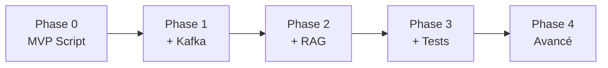

# 📋 Guide de Progression - Phases AgentMeshKafka

Ce document explique comment progresser d'une phase à l'autre dans le projet AgentMeshKafka. Chaque phase est **autonome et complète**, mais elles s'appuient les unes sur les autres pour construire progressivement un système agentique complet.

---

## 🎯 Vue d'Ensemble des Phases



| Phase | Objectif | Complexité | Temps Setup | Infrastructure |
|-------|----------|-----------|-------------|----------------|
| **0** | MVP fonctionnel | ⭐ | < 5 min | Aucune |
| **1** | Communication événementielle | ⭐⭐ | ~15 min | Kafka KRaft |
| **2** | RAG et bases vectorielles | ⭐⭐⭐ | ~20 min | Kafka + ChromaDB |
| **3** | Tests et validation | ⭐⭐⭐ | ~10 min | Kafka + ChromaDB |
| **4** | Production-ready | ⭐⭐⭐⭐ | ~30 min | Stack complète |

---

## 📦 Phase 0 : MVP Fonctionnel

**Objectif :** Comprendre les agents sans infrastructure complexe.

### Ce que vous apprenez

- Structure d'un agent LLM
- Pattern ReAct (Reason + Act)
- Validation de données avec Pydantic
- Pipeline séquentiel simple

### Ce qui est inclus

- 3 agents Python simples (Intake, Risk, Decision)
- Modèles Pydantic pour validation
- Script orchestrateur unique (`main.py`)
- Aucune dépendance Docker

### Démarrage

```bash
cd phase0
pip install -r requirements.txt
# Configurez .env avec ANTHROPIC_API_KEY
python main.py
```

### Durée estimée

- **Installation :** 2 minutes
- **Première exécution :** 1 minute
- **Compréhension :** 10-15 minutes

### Quand passer à la Phase 1

✅ Vous pouvez passer à la Phase 1 quand :
- Vous comprenez comment les 3 agents interagissent
- Vous avez modifié le code pour tester vos propres données
- Vous voulez comprendre la communication asynchrone

---

## 📡 Phase 1 : Communication Événementielle

**Objectif :** Ajouter Kafka pour découpler les agents temporellement et spatialement.

### Ce que vous apprenez

- Architecture événementielle
- Apache Kafka (mode KRaft, sans Zookeeper)
- Producers et Consumers
- Communication asynchrone

### Ce qui est ajouté

- Docker Compose avec Kafka KRaft
- Clients Kafka (Producer/Consumer)
- Agents adaptés pour consommer/produire des événements
- Topics Kafka pour chaque type d'événement

### Démarrage

```bash
cd phase1
docker-compose up -d
# Attendre que Kafka soit prêt (~30 secondes)
pip install -r requirements.txt
# Lancer les agents dans des terminaux séparés
python src/agents/intake_agent/main.py
python src/agents/risk_agent/main.py
python src/agents/decision_agent/main.py
```

### Différences avec Phase 0

| Aspect | Phase 0 | Phase 1 |
|--------|---------|---------|
| Communication | Appels directs | Événements Kafka |
| Déploiement | Script unique | 3 processus séparés |
| Infrastructure | Aucune | Kafka Docker |
| Scalabilité | Limitée | Horizontale |

### Durée estimée

- **Installation :** 5 minutes
- **Première exécution :** 5 minutes
- **Compréhension :** 20-30 minutes

### Quand passer à la Phase 2

✅ Vous pouvez passer à la Phase 2 quand :
- Vous comprenez comment les événements circulent dans Kafka
- Vous avez testé la consommation/production de messages
- Vous voulez ajouter de l'intelligence contextuelle (RAG)

---

## 🧠 Phase 2 : RAG et Bases Vectorielles

**Objectif :** Ajouter RAG (Retrieval-Augmented Generation) pour enrichir l'Agent Risk avec une base de connaissances.

### Ce que vous apprenez

- RAG (Retrieval-Augmented Generation)
- Bases vectorielles (ChromaDB)
- Embeddings et recherche sémantique
- Enrichissement contextuel des agents

### Ce qui est ajouté

- ChromaDB (base vectorielle)
- Ingestion de documents (politiques de crédit)
- Outil de recherche RAG pour l'Agent Risk
- Embeddings avec sentence-transformers

### Démarrage

```bash
cd phase2
docker-compose up -d
# Attendre Kafka + ChromaDB (~1 minute)
pip install -r requirements.txt
# Ingérer les documents de politique
python scripts/ingest_policies.py
# Lancer les agents
python src/agents/intake_agent/main.py
python src/agents/risk_agent/main.py  # Maintenant avec RAG
python src/agents/decision_agent/main.py
```

### Différences avec Phase 1

| Aspect | Phase 1 | Phase 2 |
|--------|---------|----------|
| Agent Risk | Calculs simples | RAG + Politiques |
| Base de données | Aucune | ChromaDB |
| Contexte | Limité | Enrichi par RAG |
| Précision | Basique | Améliorée |

### Durée estimée

- **Installation :** 5 minutes
- **Ingestion documents :** 2 minutes
- **Première exécution :** 5 minutes
- **Compréhension :** 30-45 minutes

### Quand passer à la Phase 3

✅ Vous pouvez passer à la Phase 3 quand :
- Vous comprenez comment le RAG enrichit les réponses
- Vous avez testé avec différents documents
- Vous voulez valider la qualité du système (tests)

---

## 🧪 Phase 3 : Tests et Validation

**Objectif :** Ajouter une suite de tests complète pour valider le système.

### Ce que vous apprenez

- Tests unitaires pour agents
- Tests d'intégration end-to-end
- Évaluation cognitive (LLM-as-a-Judge)
- Pipeline de validation

### Ce qui est ajouté

- Suite de tests pytest
- Tests unitaires (L1)
- Tests cognitifs (L2) avec LLM-Juge
- Dataset de test (Golden Dataset)
- Configuration pytest

### Démarrage

```bash
cd phase3
# Infrastructure identique à Phase 2
docker-compose up -d
pip install -r requirements.txt
# Lancer les tests
pytest tests/unit/ -v
pytest tests/evaluation/ -v
```

### Niveaux de Test

1. **L1 - Tests Unitaires** : Validation déterministe
   ```bash
   pytest tests/unit/test_models.py
   pytest tests/unit/test_tools.py
   ```

2. **L2 - Évaluation Cognitive** : Validation par LLM-Juge
   ```bash
   pytest tests/evaluation/test_risk_agent_cognitive.py
   ```

### Durée estimée

- **Installation :** 3 minutes
- **Exécution tests :** 2-5 minutes
- **Compréhension :** 20-30 minutes

### Quand passer à la Phase 4

✅ Vous pouvez passer à la Phase 4 quand :
- Tous les tests passent
- Vous comprenez les différents niveaux d'évaluation
- Vous voulez une version production-ready complète

---

## 🏭 Phase 4 : Version Avancée

**Objectif :** Version production-ready avec gouvernance complète.

### Ce que vous apprenez

- Schema Registry (gouvernance des données)
- Avro et versioning de schémas
- Observabilité et monitoring
- Évaluation avancée (L3-L4)

### Ce qui est ajouté

- Schema Registry (Confluent)
- Schémas Avro complets
- Monitoring (Control Center optionnel)
- Tests d'adversité (L3)
- Simulation d'écosystème (L4)
- Observabilité (OpenTelemetry)

### Démarrage

```bash
cd phase4
docker-compose up -d
# Attendre tous les services (~2 minutes)
pip install -r requirements.txt
# Enregistrer les schémas Avro
python scripts/register_schemas.py
# Lancer les agents
python src/agents/intake_agent/main.py
python src/agents/risk_agent/main.py
python src/agents/decision_agent/main.py
```

### Différences avec Phase 3

| Aspect | Phase 3 | Phase 4 |
|--------|---------|---------|
| Schémas | JSON/Pydantic | Avro + Schema Registry |
| Validation | Runtime | Schema Registry |
| Monitoring | Logs | Control Center |
| Tests | L1-L2 | L1-L4 complet |

### Durée estimée

- **Installation :** 10 minutes
- **Configuration :** 5 minutes
- **Première exécution :** 10 minutes
- **Compréhension :** 1-2 heures

---

## 🔄 Guide de Migration entre Phases

### De Phase 0 à Phase 1

**Changements principaux :**
1. Ajouter Docker Compose
2. Remplacer appels directs par événements Kafka
3. Séparer les agents en processus indépendants

**Fichiers à modifier :**
- Créer `docker-compose.yml`
- Adapter `agents/*.py` pour utiliser Kafka clients
- Créer `src/shared/kafka_client.py`

### De Phase 1 à Phase 2

**Changements principaux :**
1. Ajouter ChromaDB au docker-compose
2. Implémenter RAG dans l'Agent Risk
3. Ingérer des documents de politique

**Fichiers à modifier :**
- Ajouter ChromaDB dans `docker-compose.yml`
- Modifier `src/agents/risk_agent/main.py`
- Créer `scripts/ingest_policies.py`

### De Phase 2 à Phase 3

**Changements principaux :**
1. Créer la structure de tests
2. Implémenter les tests unitaires
3. Ajouter les tests cognitifs

**Fichiers à créer :**
- `tests/unit/`
- `tests/evaluation/`
- `pytest.ini`

### De Phase 3 à Phase 4

**Changements principaux :**
1. Ajouter Schema Registry
2. Convertir les modèles en schémas Avro
3. Ajouter monitoring

**Fichiers à modifier :**
- Ajouter Schema Registry dans `docker-compose.yml`
- Créer `schemas/*.avsc`
- Adapter les clients Kafka pour Avro

---

## 🎓 Parcours Recommandés

### Parcours Rapide (Démonstration)

```
Phase 0 → Compréhension basique (30 min)
```

**Idéal pour :** Présentation rapide, démo en 5 minutes

### Parcours Standard (Projet d'École)

```
Phase 0 → Phase 1 → Phase 2 (2-3 semaines)
```

**Idéal pour :** Projet académique de 2-3 mois, compréhension complète

### Parcours Complet (Projet d'Étudiant)

```
Phase 0 → Phase 1 → Phase 2 → Phase 3 (4-6 semaines)
```

**Idéal pour :** Projet de 3-6 mois, validation complète

### Parcours Expert (Thèse/Production)

```
Phase 0 → Phase 1 → Phase 2 → Phase 3 → Phase 4 (2-3 mois)
```

**Idéal pour :** Projet long terme, production-ready

---

## 💡 Conseils de Progression

1. **Ne sautez pas de phases** : Chaque phase construit sur la précédente
2. **Testez chaque phase** : Assurez-vous que tout fonctionne avant de passer à la suivante
3. **Lisez les README** : Chaque phase a son propre README avec détails
4. **Explorez le code** : Modifiez les exemples pour mieux comprendre
5. **Consultez les notebooks** : Les tutoriels Jupyter aident à visualiser

---

## ❓ Questions Fréquentes

**Q : Puis-je utiliser uniquement la Phase 4 ?**  
R : Oui, mais vous perdrez la compréhension progressive. Recommandé pour les experts.

**Q : Puis-je mélanger des éléments de différentes phases ?**  
R : Oui, mais attention aux dépendances. Chaque phase est autonome par design.

**Q : Combien de temps pour maîtriser toutes les phases ?**  
R : Environ 2-3 mois avec pratique régulière.

**Q : Quelle phase pour la production ?**  
R : Phase 4 uniquement. Les autres phases sont pédagogiques.

---

## 📚 Ressources par Phase

- **Phase 0** : [QUICKSTART.md](QUICKSTART.md)
- **Phase 1** : `phase1/README.md`
- **Phase 2** : `phase2/README.md`
- **Phase 3** : `phase3/README.md`
- **Phase 4** : `phase4/README.md`

---

**Besoin d'aide ?** Consultez les README de chaque phase ou ouvrez une issue sur GitHub.
