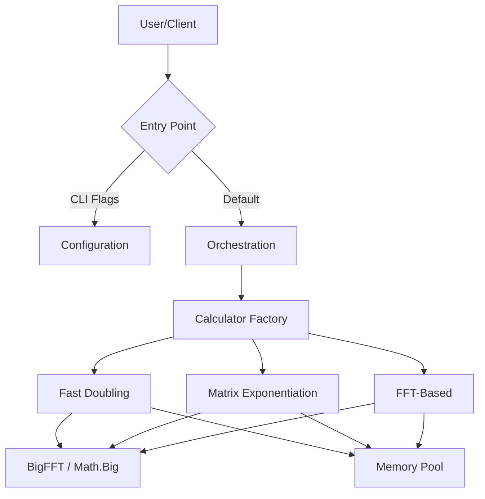

# FibCalc: High-Performance Fibonacci Calculator


**FibCalc** is a state-of-the-art command-line tool and library designed for computing arbitrarily large Fibonacci numbers with extreme speed and efficiency. Written in Go, it leverages advanced algorithmic optimizations—including Fast Doubling, Matrix Exponentiation with Strassen's algorithm, and FFT-based multiplication—to handle indices in the hundreds of millions.

> **"The fastest, most over-engineered Fibonacci calculator you will ever use."**

---

## 📋 Table of Contents

1. [Overview](#-overview)
2. [Key Features](#-key-features)
3. [Quick Start](#-quick-start)
4. [Mathematical Background](#-mathematical-background)
5. [Architecture](#%EF%B8%8F-architecture)
6. [Installation](#-installation)
7. [Usage Guide](#%EF%B8%8F-usage-guide)
8. [Performance Benchmarks](#-performance-benchmarks)
9. [Troubleshooting](#-troubleshooting)
10. [Configuration](#%EF%B8%8F-configuration)
11. [Development](#-development)
12. [Contributing](#-contributing)
13. [License](#-license)
14. [Acknowledgments](#-acknowledgments)

---

## 🔭 Overview

FibCalc serves as both a practical high-performance tool and a reference implementation for advanced software engineering patterns in Go. It demonstrates how to handle extreme computational workloads, optimize memory usage via zero-allocation strategies, and structure a clean, testable application.

### Why FibCalc?

- **Extreme Performance**: Calculates $F(250,000,000)$ in minutes, not hours.
- **Precision**: Handles numbers with millions of digits without precision loss.
- **Educational**: Implements and visualizes complex algorithms (Fast Doubling, Strassen, FFT).
- **Production Ready**: Includes structured logging, configurable timeouts, and robust error handling.

---

## 🚀 Key Features

### Advanced Algorithms

- **Fast Doubling** (Default): The fastest known method ($O(\log n)$), utilizing the identity $F(2k) = F(k)(2F(k+1) - F(k))$.
- **Matrix Exponentiation**: Classic $O(\log n)$ approach enhanced with **Strassen's Algorithm** for large matrices and symmetric squaring optimizations.
- **FFT-Based Multiplication**: Automatically switches to Fast Fourier Transform for multiplication when numbers exceed a configurable threshold (default ~500k bits), reducing complexity from $O(n^{1.585})$ to $O(n \log n)$.
- **GMP Support**: Optional build tag to use the GNU Multiple Precision Arithmetic Library for maximum raw performance on supported systems.

### High-Performance Engineering

- **Zero-Allocation Strategy**: Extensive use of `sync.Pool` to recycle `big.Int` objects and custom calculation states, reducing Garbage Collector pressure by over 95%.
- **Bump Allocator**: O(1) temporary allocation for FFT operations via pointer bump, providing zero fragmentation and excellent cache locality (`internal/bigfft/bump.go`).
- **Zero-Copy Result Return**: Eliminates expensive O(n) result copies by stealing pointers from pooled calculation state, trading a full copy for a single 24-byte `big.Int` header allocation.
- **FFT Transform Caching**: Thread-safe LRU cache for forward FFT transforms avoids recomputation of repeated values, providing 15-30% speedup in iterative algorithms.
- **Transform Reuse**: Optimized squaring uses a single forward transform (vs two in multiplication), reducing FFT work per doubling step.
- **Dynamic Threshold Adjustment**: FFT and parallel execution thresholds are adjusted at runtime based on observed per-iteration performance metrics, with hysteresis to prevent oscillation.
- **Adaptive Parallelism**: Automatically parallelizes recursive branches and matrix operations across CPU cores based on input size and hardware capabilities.
- **Concurrency Limiting**: Task semaphore limits concurrent goroutines to `runtime.NumCPU()*2`, preventing contention and memory pressure during parallel multiplication.
- **Optimized Memory Zeroing**: Uses Go 1.21+ `clear()` builtin for efficient slice zeroing in FFT operations.
- **Auto-Calibration**: Built-in benchmarking tool (`-calibrate`) to empirically determine the optimal parallelism and FFT thresholds for the host machine.
- **Atomic Pre-Warming**: Optimized memory pool initialization ensures resources are ready before the first request.

### Robust Architecture

- **Clean Architecture**: Strict separation of concerns (Core Logic, Orchestration, Interface, Infrastructure) with interface-based decoupling.
- **Interface-Based Decoupling**: The orchestration layer uses `ProgressReporter` and `ResultPresenter` interfaces to avoid depending on CLI, enabling testability and alternative presentations.
- **Modern CLI**: Features progress spinners, ETA calculation, formatted output, and colour themes.
- **Interactive TUI Dashboard**: Optional btop-inspired terminal dashboard (`--tui`) with real-time progress logs, memory metrics, progress bar with ETA, and keyboard navigation — powered by [Bubble Tea](https://github.com/charmbracelet/bubbletea).

---

## ⚡ Quick Start

```bash
# Clone the repository
git clone https://github.com/agbru/fibcalc.git
cd fibcalc

# Build the CLI
go build -o fibcalc ./cmd/fibcalc

# Calculate F(1,000,000) using the fastest algorithm
./fibcalc -n 1000000 -algo fast

# Run the test suite
go test -v -race -cover ./...
```

---

## 📐 Mathematical Background

FibCalc implements several sophisticated mathematical concepts to achieve its performance.

### 1. Fast Doubling Identities

The most efficient algorithm avoids matrix operations entirely and computes $F(n)$ and $F(n+1)$ directly using the following recursive identities derived from the matrix form:

$$
\begin{aligned}
F(2k) &= F(k) \times (2F(k+1) - F(k)) \\
F(2k+1) &= F(k+1)^2 + F(k)^2
\end{aligned}
$$

This reduces the complexity to $O(\log n)$ operations. Each step roughly doubles the index, hence "Fast Doubling". See [Docs/algorithms/FAST_DOUBLING.md](Docs/algorithms/FAST_DOUBLING.md) for details.

### 2. Matrix Exponentiation & Strassen's Algorithm

The Fibonacci sequence can be generated by raising the "Q-matrix" to the power of $n$:

$$
\begin{pmatrix} F_{n+1} & F_n \\ F_n & F_{n-1} \end{pmatrix} = \begin{pmatrix} 1 & 1 \\ 1 & 0 \end{pmatrix}^n
$$

For large matrices, FibCalc employs **Strassen's Algorithm**, which reduces the number of multiplications in a $2 \times 2$ matrix product from 8 to 7. While this introduces more additions, it is beneficial when multiplication is significantly more expensive than addition (i.e., for very large `big.Int` values). See [Docs/algorithms/MATRIX.md](Docs/algorithms/MATRIX.md) for details.

### 3. FFT-Based Multiplication

For extremely large numbers (hundreds of thousands of bits), standard Karatsuba multiplication ($O(n^{1.585})$) becomes the bottleneck. FibCalc switches to **FFT multiplication** ($O(n \log n)$) based on the Convolution Theorem:

$$
A \times B = \text{IDFT}(\text{DFT}(A) \cdot \text{DFT}(B))
$$

This allows calculating numbers with billions of digits feasible. See [Docs/algorithms/FFT.md](Docs/algorithms/FFT.md) for details.

> **Algorithm deep dives**: [Comparison](Docs/algorithms/COMPARISON.md) | [BigFFT Internals](Docs/algorithms/BIGFFT.md) | [GMP](Docs/algorithms/GMP.md) | [Progress Bar](Docs/algorithms/PROGRESS_BAR_ALGORITHM.md)

---

## 🏗️ Architecture

FibCalc follows **Clean Architecture** principles to ensure modularity and testability.



### Core Components

| Component | Responsibility |
|-----------|----------------|
| `cmd/generate-golden` | Golden file generator for test data. |
| `internal/fibonacci` | Core domain logic. Implements the `Calculator` interface and algorithms. |
| `internal/bigfft` | Specialized FFT arithmetic for `big.Int` with memory pooling. |
| `internal/orchestration` | Manages concurrent execution, result aggregation, and defines `ProgressReporter`/`ResultPresenter` interfaces for Clean Architecture decoupling. |
| `internal/cli` | Progress bar, spinner, output formatting (Display*/Format*/Write*), and duration/ETA helpers. |
| `internal/calibration` | Auto-tuning logic to find optimal hardware thresholds. |
| `internal/parallel` | Parallel execution utilities. |
| `internal/logging` | Structured logging with zerolog adapters. |
| `internal/tui` | Interactive TUI dashboard (btop-style) powered by Bubble Tea, with real-time logs, metrics, progress bar with ETA, and keyboard navigation. |
| `internal/app` | CLI application runner, version info. |
| `internal/ui` | Color themes, terminal formatting, NO_COLOR environment variable support. |
| `internal/config` | Configuration parsing, validation, and environment variable support. |
| `internal/errors` | Custom error types with standardized exit codes. |
| `internal/testutil` | Shared test utilities and helpers. |

---

## 📦 Installation

Requires **Go 1.25** or later.

```bash
git clone https://github.com/agbru/fibcalc.git
cd fibcalc
go test ./...  # Verify everything works
```

```bash
go build -o fibcalc ./cmd/fibcalc
```

---

## 🛠️ Usage Guide

### Command Synopsis

```text
fibcalc [flags]
```

### Common Flags

| Flag | Short | Default | Description |
|------|-------|---------|-------------|
| `-n` | | `100,000,000` | The Fibonacci index to calculate. |
| `-algo` | | `all` | Algorithm: `fast`, `matrix`, `fft`, or `all`. |
| `-calculate` | `-c` | `false` | Display the calculated Fibonacci value. |
| `-verbose` | `-v` | `false` | Display the full value of the result. |
| `-details` | `-d` | `false` | Display performance details and result metadata. |
| `-output` | `-o` | | Write result to a file. |
| `-quiet` | `-q` | `false` | Minimal output for scripting. |
| `-calibrate` | | `false` | Run system benchmarks to find optimal thresholds. |
| `-auto-calibrate` | | `false` | Quick automatic calibration at startup. |
| `-calibration-profile` | | | Path to calibration profile file. |
| `-timeout` | | `5m` | Maximum calculation time (e.g. "10s", "1h"). |
| `-threshold` | | `4096` | Parallelism threshold (bits). |
| `-fft-threshold` | | `500,000` | FFT multiplication threshold (bits). |
| `-strassen-threshold` | | `3072` | Strassen algorithm threshold (bits). |
| `-tui` | | `false` | Launch the interactive TUI dashboard instead of the standard CLI. |
| `-completion` | | | Generate shell completion script (bash, zsh, fish, powershell). |

> **Note**: Colored output can be disabled by setting the `NO_COLOR` environment variable (see [no-color.org](https://no-color.org/)).

### TUI Dashboard Mode

FibCalc includes an interactive terminal dashboard inspired by [btop](https://github.com/aristocratos/btop). Activate it with `--tui`:

```bash
fibcalc --tui -n 1000000
```

```
┌─────────────────────────────────────────────────────────────────┐
│  FibGo Monitor                v0.1.0         Elapsed: 0m 12s   │
├──────────────────────────────────────┬──────────────────────────┤
│  Calculations Log                    │  Metrics                 │
│                                      │   Memory:    42.3 MB     │
│  [12:00:01] Fast Doubling    12.3%   │   Heap:      38.1 MB     │
│  [12:00:02] Matrix Exp        8.7%   │   GC Runs:   12          │
│  [12:00:03] FFT Based        15.1%   │   Speed:     0.15 /s     │
│  [12:00:04] Fast Doubling    34.5%   │   Goroutines: 8          │
│  ...                                 ├──────────────────────────┤
│                                      │  Progress Chart          │
│  [12:00:08] Fast Doubling   100% OK  │                          │
│  [12:00:09] Matrix Exp      100% OK  │  [████████░░░░]  67.8%   │
│  [12:00:10] FFT Based       100% OK  │                          │
│                                      │  ETA: 4s                 │
├──────────────────────────────────────┴──────────────────────────┤
│  q: Quit   r: Reset   space: Pause/Resume       Status: Running │
└─────────────────────────────────────────────────────────────────┘
```

**Keyboard shortcuts:**

| Key | Action |
|-----|--------|
| `q` / `Ctrl+C` | Quit (cancels calculations) |
| `Space` | Pause/Resume display (calculations continue) |
| `r` | Restart calculation (reset all panels) |
| `Up` / `k` | Scroll logs up |
| `Down` / `j` | Scroll logs down |
| `PgUp` / `PgDn` | Fast scroll |

The dashboard shows five panels: header with elapsed time, scrollable calculation logs (60% width), runtime memory metrics, a progress bar with ETA tracking, and a footer with status indicator. The TUI uses the same `ProgressReporter`/`ResultPresenter` interfaces as the CLI, ensuring identical calculation behavior.

### Advanced Examples

**1. Compare Algorithms with Detail**
Run all algorithms and compare their performance for $F(10,000,000)$, outputting detailed stats.

```bash
fibcalc -n 10000000 -algo all -details
```

**2. Optimize for Your Machine**
Run calibration to find the best parallelism thresholds for your specific CPU and RAM.

```bash
fibcalc -calibrate
```

**3. Interactive TUI Dashboard**
Monitor all algorithms in real-time with the btop-style dashboard.

```bash
fibcalc --tui -n 5000000 -algo all
```

**4. Large Number with FFT Tuning**
Force FFT usage for a smaller threshold to test performance on lower-end hardware.

```bash
fibcalc -n 5000000 -algo fast -fft-threshold 100000
```

---

## 📊 Performance Benchmarks

FibCalc is optimized for speed. Below is a summary of performance characteristics on a high-end workstation (Intel Core Ultra 9 275HX, 24 cores).

| Index ($N$) | Fast Doubling | Matrix Exp. | FFT-Based | Result (digits) |
| :--- | :--- | :--- | :--- | :--- |
| **10,000** | 120µs | 180µs | 280µs | 2,090 |
| **1,000,000** | ~3ms | 55ms | 45ms | 208,988 |
| **10,000,000** | ~60ms | 750ms | 600ms | 2,089,877 |
| **100,000,000** | 30s | 42s | 33s | 20,898,764 |
| **250,000,000** | 2m 10s | 3m 05s | 2m 25s | 52,246,909 |

### Algorithm Selection Guide

- **Use `fast` (Fast Doubling)** for general purpose high performance. It is consistently the fastest across all ranges.
- **Use `matrix`** for educational purposes or verification.
- **Use `fft`** primarily for benchmarking the multiplication engine itself, or for $N > 100,000,000$ where it becomes very competitive.

> **Full performance guide**: [Docs/PERFORMANCE.md](Docs/PERFORMANCE.md)

---

## 🔧 Troubleshooting

Common issues and their solutions.

### 1. `runtime: out of memory`
Calculating huge Fibonacci numbers requires significant RAM. $F(1,000,000,000)$ requires ~25 GB of RAM.
**Solution**: Reduce $N$, add swap space, or use a machine with more RAM.

### 2. Calculation hangs / Timeout
For very large $N$, the calculation might exceed the default 5-minute timeout.
**Solution**: Increase the timeout with `-timeout 30m`.

---

## ⚙️ Configuration

Environment variables can override CLI flags. Priority: CLI flags > Environment variables > Defaults.

| Variable | Description | Default |
|----------|-------------|---------|
| `FIBCALC_N` | Fibonacci index to calculate | 100,000,000 |
| `FIBCALC_ALGO` | Algorithm (`fast`, `matrix`, `fft`, `all`) | `all` |
| `FIBCALC_TIMEOUT` | Calculation timeout | `5m` |
| `FIBCALC_THRESHOLD` | Parallelism threshold (bits) | 4096 |
| `FIBCALC_FFT_THRESHOLD` | FFT multiplication threshold (bits) | 500,000 |
| `FIBCALC_STRASSEN_THRESHOLD` | Strassen algorithm threshold (bits) | 3072 |
| `FIBCALC_VERBOSE` | Enable verbose output | `false` |
| `FIBCALC_DETAILS` | Display performance details | `false` |
| `FIBCALC_QUIET` | Enable quiet mode | `false` |
| `FIBCALC_TUI` | Enable interactive TUI dashboard | `false` |
| `FIBCALC_CALCULATE` | Display calculated value | `false` |
| `FIBCALC_OUTPUT` | Output file path | |
| `FIBCALC_CALIBRATE` | Enable calibration mode | `false` |
| `FIBCALC_AUTO_CALIBRATE` | Enable automatic calibration | `false` |
| `FIBCALC_CALIBRATION_PROFILE` | Path to calibration profile file | |
| `NO_COLOR` | Disable colored output ([no-color.org](https://no-color.org/)) | |

---

## 💻 Development

### Prerequisites
- Go 1.25+
- golangci-lint (optional, for linting)

### Key Commands

```bash
go test -v -race -cover ./...                          # Run all tests with race detector
go test -v -short ./...                                # Skip slow tests
go test -v -run TestFastDoubling ./internal/fibonacci/  # Run a single test
go test -bench=. -benchmem ./internal/fibonacci/        # Run benchmarks
go test -fuzz=FuzzFastDoubling ./internal/fibonacci/    # Run fuzz tests
go generate ./...                                       # Regenerate mocks
```

If `make` is available, Makefile targets are also provided:

```bash
make test        # go test -v -race -cover ./...
make lint        # golangci-lint run ./...
make check       # format + lint + test
make coverage    # Generate coverage report (coverage.html)
make benchmark   # Run performance benchmarks
```

### Project Structure
- `cmd/generate-golden/`: Golden file generator for test data.
- `internal/`: Private application code (algorithms, CLI, orchestration, etc.).
- `Docs/`: Detailed documentation ([Architecture](Docs/ARCHITECTURE.md), [Performance](Docs/PERFORMANCE.md), [Algorithms](Docs/algorithms/), [Design Patterns](Docs/DESIGN_PATTERNS.md), [Build](Docs/BUILD.md), [Testing](Docs/TESTING.md), [Calibration](Docs/CALIBRATION.md), [TUI Guide](Docs/TUI_GUIDE.md)).

---

## 🤝 Contributing

Contributions are welcome! Please read [CONTRIBUTING.md](CONTRIBUTING.md) for details on our code of conduct, and the process for submitting pull requests.

---

## 📄 License

This project is licensed under the Apache License 2.0 - see the [LICENSE](LICENSE) file for details.

---

## 🙏 Acknowledgments

- The Go team for the `math/big` package.
- The open-source community for the underlying FFT research.
- All contributors who have optimized these algorithms over the years.
