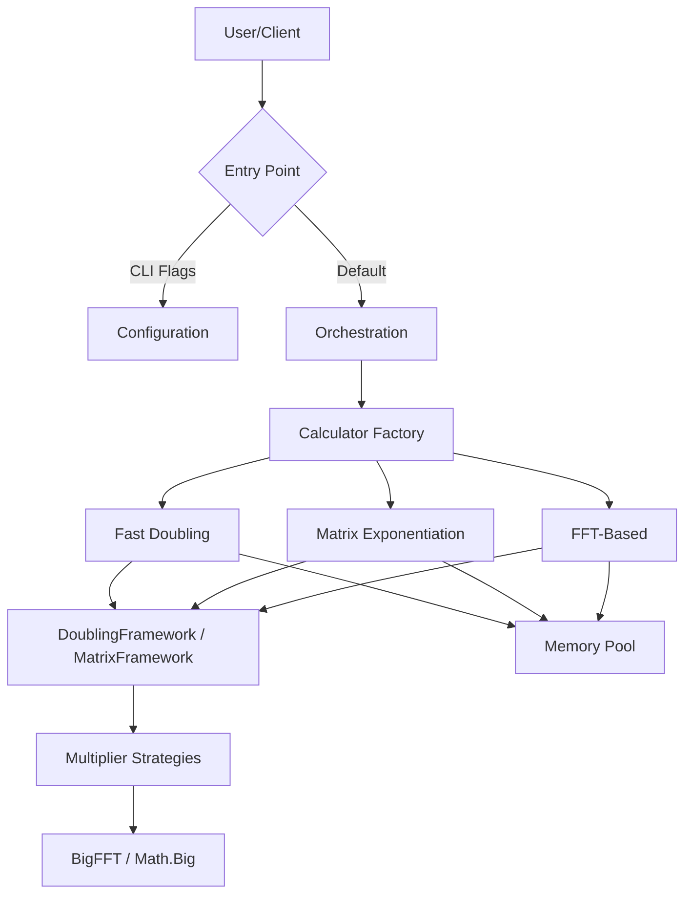

# FibCalc: High-Performance Fibonacci Calculator


**FibCalc** is a state-of-the-art command-line tool and library designed for computing arbitrarily large Fibonacci numbers with extreme speed and efficiency. Written in Go, it leverages advanced algorithmic optimizations — including Fast Doubling, Matrix Exponentiation with Strassen's algorithm, and FFT-based multiplication — to handle indices in the hundreds of millions.

> **"The fastest, most over-engineered Fibonacci calculator you will ever use."**

---

## Table of Contents

1. [Overview](#overview)
2. [Key Features](#key-features)
3. [Quick Start](#quick-start)
4. [Mathematical Background](#mathematical-background)
5. [Architecture](#architecture)
6. [Installation](#installation)
7. [Usage Guide](#usage-guide)
8. [Performance Benchmarks](#performance-benchmarks)
9. [Testing](#testing)
10. [Troubleshooting](#troubleshooting)
11. [Configuration](#configuration)
12. [Development](#development)
13. [Contributing](#contributing)
14. [License](#license)
15. [Acknowledgments](#acknowledgments)

---

## Overview

FibCalc serves as both a practical high-performance tool and a reference implementation for advanced software engineering patterns in Go. It demonstrates how to handle extreme computational workloads, optimize memory usage via zero-allocation strategies, and structure a clean, testable application.

### Why FibCalc?

- **Extreme Performance**: Calculates $F(250,000,000)$ in minutes, not hours.
- **Precision**: Handles numbers with millions of digits without precision loss.
- **Educational**: Implements and visualizes complex algorithms (Fast Doubling, Strassen, FFT).
- **Production Ready**: Includes structured logging, configurable timeouts, and robust error handling.

---

## Key Features

### Advanced Algorithms

- **Fast Doubling** (Default): The fastest known method ($O(\log n)$), utilizing the identity $F(2k) = F(k)(2F(k+1) - F(k))$.
- **Matrix Exponentiation**: Classic $O(\log n)$ approach enhanced with **Strassen's Algorithm** for large matrices and symmetric squaring optimizations.
- **FFT-Based Multiplication**: Automatically switches to Fast Fourier Transform (Schonhage-Strassen over Fermat rings) for multiplication when numbers exceed a configurable threshold (default ~500k bits), reducing complexity from $O(n^{1.585})$ to $O(n \log n)$.
- **GMP Support**: Optional build tag to use the GNU Multiple Precision Arithmetic Library for maximum raw performance on supported systems.

### High-Performance Engineering

- **Zero-Allocation Strategy**: Extensive use of `sync.Pool` to recycle `big.Int` objects and custom calculation states, reducing Garbage Collector pressure by over 95%.
- **Bump Allocator**: O(1) temporary allocation for FFT operations via pointer bump, providing zero fragmentation and excellent cache locality (`internal/bigfft/bump.go`).
- **Zero-Copy Result Return**: Eliminates expensive O(n) result copies by stealing pointers from pooled calculation state, trading a full copy for a single 24-byte `big.Int` header allocation.
- **Calculation Arena**: Contiguous bump-pointer allocator for all `big.Int` state, reducing GC pressure and memory fragmentation (`internal/fibonacci/arena.go`).
- **GC Controller**: Disables garbage collection during large calculations (N ≥ 1M) with soft memory limit safety net, reducing ~2× GC memory overhead (`internal/fibonacci/gc_control.go`).
- **Memory Budget Estimation**: Pre-calculation memory estimation with `--memory-limit` validation to prevent OOM on constrained hardware.
- **Modular Fast Doubling**: O(K) memory mode for computing the last K digits of F(N) via `--last-digits`, enabling arbitrarily large N.
- **FFT Transform Caching**: Thread-safe LRU cache for forward FFT transforms avoids recomputation of repeated values, providing 15-30% speedup in iterative algorithms.
- **Transform Reuse**: Optimized squaring uses a single forward transform (vs two in multiplication), reducing FFT work per doubling step.
- **Dynamic Threshold Adjustment**: FFT and parallel execution thresholds are adjusted at runtime based on observed per-iteration performance metrics, with hysteresis to prevent oscillation. Strassen thresholds are also runtime-configurable via `SetDefaultStrassenThreshold()`.
- **Runtime-Configurable FFT Parallelism**: FFT recursion parallelism thresholds (`ParallelFFTRecursionThreshold`, `MaxParallelFFTDepth`) can be tuned at runtime via `SetFFTParallelismConfig()` for hardware-specific optimization.
- **Adaptive Parallelism**: Automatically parallelizes recursive branches and matrix operations across CPU cores based on input size and hardware capabilities.
- **Concurrency Limiting**: Task semaphore limits concurrent goroutines to `runtime.NumCPU()*2`, preventing contention and memory pressure during parallel multiplication.
- **Auto-Calibration**: Built-in benchmarking tool (`-calibrate`) to empirically determine the optimal parallelism and FFT thresholds for the host machine. Adaptive threshold estimation at startup based on CPU core count and architecture.
- **Go Generics**: `executeTasks[T, PT]()` uses generics with pointer constraint pattern to eliminate code duplication between multiplication and squaring task execution.

### Robust Architecture

- **Clean Architecture**: Strict separation of concerns (Core Logic, Orchestration, Interface, Infrastructure) with interface-based decoupling.
- **Interface-Based Decoupling**: The orchestration layer uses `ProgressReporter` and `ResultPresenter` interfaces to avoid depending on CLI, enabling testability and alternative presentations.
- **Strategy + Interface Segregation (ISP)**: Narrow `Multiplier` interface for basic operations, wider `DoublingStepExecutor` for optimized doubling steps. Three concrete strategies: `AdaptiveStrategy`, `FFTOnlyStrategy`, `KaratsubaStrategy`. The legacy `MultiplicationStrategy` type alias is deprecated.
- **Framework Pattern**: `DoublingFramework` and `MatrixFramework` encapsulate algorithm loops, accepting pluggable strategies.
- **Modern CLI**: Features progress spinners, ETA calculation, formatted output, and color themes.
- **Interactive TUI Dashboard**: Optional btop-inspired terminal dashboard (`--tui`) with real-time progress logs, system memory metrics, progress bar with ETA, sparkline charts, and keyboard navigation — powered by [Bubble Tea](https://github.com/charmbracelet/bubbletea).

---

## Quick Start

```bash
# Clone the repository
git clone https://github.com/agbru/fibcalc.git
cd fibcalc

# Build the CLI
go build -o fibcalc ./cmd/fibcalc

# Calculate F(1,000,000) using the fastest algorithm
./fibcalc -n 1000000 -algo fast

# Run the test suite
go test -v -race -cover ./...
```

---

## Mathematical Background

FibCalc implements several sophisticated mathematical concepts to achieve its performance.

### 1. Fast Doubling Identities

The most efficient algorithm avoids matrix operations entirely and computes $F(n)$ and $F(n+1)$ directly using the following recursive identities derived from the matrix form:

$$
\begin{aligned}
F(2k) &= F(k) \times (2F(k+1) - F(k)) \\
F(2k+1) &= F(k+1)^2 + F(k)^2
\end{aligned}
$$

> **Implementation note**: The codebase uses the equivalent reformulation `F(2k) = 2·F(k)·F(k+1) - F(k)²` which eliminates a temporary variable. Both are algebraically identical (expand `F(k)·(2F(k+1) - F(k))` to verify).

This reduces the complexity to $O(\log n)$ operations. Each step roughly doubles the index, hence "Fast Doubling". See [docs/algorithms/FAST_DOUBLING.md](docs/algorithms/FAST_DOUBLING.md) for details.

### 2. Matrix Exponentiation & Strassen's Algorithm

The Fibonacci sequence can be generated by raising the "Q-matrix" to the power of $n$:

$$
\begin{pmatrix} F_{n+1} & F_n \\ F_n & F_{n-1} \end{pmatrix} = \begin{pmatrix} 1 & 1 \\ 1 & 0 \end{pmatrix}^n
$$

For large matrices, FibCalc employs **Strassen's Algorithm**, which reduces the number of multiplications in a $2 \times 2$ matrix product from 8 to 7. While this introduces more additions, it is beneficial when multiplication is significantly more expensive than addition (i.e., for very large `big.Int` values). Additionally, **symmetric matrix squaring** reduces the squaring operation from 8 to 4 multiplications by exploiting the symmetry of the Fibonacci Q-matrix. See [docs/algorithms/MATRIX.md](docs/algorithms/MATRIX.md) for details.

### 3. FFT-Based Multiplication

For extremely large numbers (hundreds of thousands of bits), standard Karatsuba multiplication ($O(n^{1.585})$) becomes the bottleneck. FibCalc switches to **FFT multiplication** ($O(n \log n)$) based on the Convolution Theorem:

$$
A \times B = \text{IDFT}(\text{DFT}(A) \cdot \text{DFT}(B))
$$

This allows calculating numbers with billions of digits feasible. See [docs/algorithms/FFT.md](docs/algorithms/FFT.md) for details.

> **Algorithm deep dives**: [Comparison](docs/algorithms/COMPARISON.md) | [BigFFT Internals](docs/algorithms/BIGFFT.md) | [GMP](docs/algorithms/GMP.md) | [Progress Bar](docs/algorithms/PROGRESS_BAR_ALGORITHM.md)

---

## Architecture

FibCalc follows **Clean Architecture** principles to ensure modularity and testability.



### Core Components

| Component | Responsibility |
|-----------|----------------|
| `cmd/fibcalc` | Application entry point. Delegates to `app.New()` and `app.Run()`. |
| `cmd/generate-golden` | Golden file generator for test data. |
| `internal/fibonacci` | Core domain logic. Algorithms (`FastDoubling`, `MatrixExponentiation`, `FFTBased`), frameworks, interfaces, strategies (ISP: `Multiplier`/`DoublingStepExecutor`), observer pattern, state pooling, dynamic thresholds, sequence generation. |
| `internal/bigfft` | Specialized FFT arithmetic for `big.Int`: Fermat ring arithmetic, FFT core and recursion with runtime-configurable parallelism, polynomial operations, thread-safe LRU transform cache, bump allocator, memory pool with pre-warming. |
| `internal/orchestration` | Concurrent calculator execution via `errgroup`, result aggregation and comparison, calculator selection. Defines `ProgressReporter`/`ResultPresenter` interfaces. |
| `internal/cli` | Progress bar with ETA, spinner, output formatting (Display\*/Format\*/Write\*/Print\*), shell completion (bash/zsh/fish/powershell). |
| `internal/tui` | Interactive TUI dashboard (btop-style) powered by Bubble Tea: model (Elm architecture), header/footer panels, scrollable logs, runtime metrics, progress chart with sparklines. |
| `internal/calibration` | Auto-tuning: full calibration mode, adaptive hardware-based threshold estimation, micro-benchmarks, calibration profile persistence (JSON). |
| `internal/config` | Configuration parsing (`flag`), environment variable overrides (`FIBCALC_*` prefix), validation. |
| `internal/app` | Application lifecycle, command dispatching (completion/calibration/TUI/CLI modes), version info with ldflags injection. |
| `internal/errors` | Custom error types (`ConfigError`, `CalculationError`) with standardized exit codes (0-4, 130). |
| `internal/parallel` | `ErrorCollector` for thread-safe first-error aggregation across goroutines. |
| `internal/format` | Duration/number formatting and ETA display utilities shared by CLI and TUI. |
| `internal/metrics` | Performance indicators (bits/s, digits/s, steps/s) and runtime memory statistics (`MemoryCollector`, `MemorySnapshot`). |
| `internal/sysmon` | System-wide CPU and memory monitoring via gopsutil (used by TUI metrics panel). |
| `internal/ui` | Color themes, terminal formatting, `NO_COLOR` support. |
| `internal/testutil` | Shared test utilities (ANSI escape code stripping). |

> **Full architecture documentation**: [docs/architecture/README.md](docs/architecture/README.md) | [Design Patterns](docs/architecture/patterns/design-patterns.md)

---

## Installation

Requires **Go 1.25** or later.

```bash
git clone https://github.com/agbru/fibcalc.git
cd fibcalc
go test ./...  # Verify everything works
```

```bash
go build -o fibcalc ./cmd/fibcalc
```

---

## Usage Guide

### Command Synopsis

```text
fibcalc [flags]
```

### Common Flags

| Flag | Short | Default | Description |
|------|-------|---------|-------------|
| `-n` | | `100,000,000` | The Fibonacci index to calculate. |
| `-algo` | | `all` | Algorithm: `fast`, `matrix`, `fft`, or `all`. |
| `-calculate` | `-c` | `false` | Display the calculated Fibonacci value. |
| `-verbose` | `-v` | `false` | Display the full value of the result. |
| `-details` | `-d` | `false` | Display performance details and result metadata. |
| `-output` | `-o` | | Write result to a file. |
| `-quiet` | `-q` | `false` | Minimal output for scripting. |
| `-calibrate` | | `false` | Run system benchmarks to find optimal thresholds. |
| `-auto-calibrate` | | `false` | Quick automatic calibration at startup. |
| `-calibration-profile` | | | Path to calibration profile file. |
| `-timeout` | | `5m` | Maximum calculation time (e.g. "10s", "1h"). |
| `-threshold` | | `0` (auto) | Parallelism threshold (bits). 0 = hardware-adaptive. |
| `-fft-threshold` | | `0` (auto) | FFT multiplication threshold (bits). 0 = hardware-adaptive. |
| `-strassen-threshold` | | `0` (auto) | Strassen algorithm threshold (bits). 0 = hardware-adaptive. |
| `-tui` | | `false` | Launch the interactive TUI dashboard instead of the standard CLI. |
| `-completion` | | | Generate shell completion script (bash, zsh, fish, powershell). |
| `--version` | `-V` | | Display version information. |
| `--last-digits` | | `0` | Compute only the last K decimal digits (uses O(K) memory). |
| `--memory-limit` | | | Maximum memory budget (e.g., 8G, 512M). Warns if estimate exceeds limit. |
| `--gc-control` | | `auto` | GC control during calculation (auto, aggressive, disabled). |

> **Note**: Threshold defaults of `0` trigger automatic hardware-adaptive estimation based on CPU core count and architecture. Static defaults used by the algorithm internals: parallelism = 4,096 bits, FFT = 500,000 bits, Strassen = 3,072 bits (config level); the internal Strassen default is 256 bits, adjustable at runtime via `SetDefaultStrassenThreshold()`.

> **Note**: Colored output can be disabled by setting the `NO_COLOR` environment variable (see [no-color.org](https://no-color.org/)).

### TUI Dashboard Mode

FibCalc includes an interactive terminal dashboard inspired by [btop](https://github.com/aristocratos/btop). Activate it with `--tui`:

```bash
fibcalc --tui -n 1000000
```

```
┌─────────────────────────────────────────────────────────────────┐
│  FibGo Monitor                v0.1.0         Elapsed: 0m 12s   │
├──────────────────────────────────────┬──────────────────────────┤
│  Calculations Log                    │  Metrics                 │
│                                      │   Memory:    42.3 MB     │
│  [12:00:01] Fast Doubling    12.3%   │   Heap:      38.1 MB     │
│  [12:00:02] Matrix Exp        8.7%   │   GC Runs:   12          │
│  [12:00:03] FFT Based        15.1%   │   Speed:     0.15 /s     │
│  [12:00:04] Fast Doubling    34.5%   │   Goroutines: 8          │
│  ...                                 ├──────────────────────────┤
│                                      │  Progress Chart          │
│  [12:00:08] Fast Doubling   100% OK  │                          │
│  [12:00:09] Matrix Exp      100% OK  │  [████████░░░░]  67.8%   │
│  [12:00:10] FFT Based       100% OK  │                          │
│                                      │  ETA: 4s                 │
├──────────────────────────────────────┴──────────────────────────┤
│  q: Quit   r: Reset   space: Pause/Resume       Status: Running │
└─────────────────────────────────────────────────────────────────┘
```

**Keyboard shortcuts:**

| Key | Action |
|-----|--------|
| `q` / `Ctrl+C` | Quit (cancels calculations) |
| `Space` | Pause/Resume display (calculations continue) |
| `r` | Restart calculation (reset all panels) |
| `Up` / `k` | Scroll logs up |
| `Down` / `j` | Scroll logs down |
| `PgUp` / `PgDn` | Fast scroll |

The dashboard shows five panels: header with elapsed time, scrollable calculation logs (60% width), runtime memory metrics, a progress bar with ETA tracking and sparkline chart, and a footer with status indicator. The TUI uses the same `ProgressReporter`/`ResultPresenter` interfaces as the CLI, ensuring identical calculation behavior.

### Advanced Examples

**1. Compare Algorithms with Detail**
Run all algorithms and compare their performance for $F(10,000,000)$, outputting detailed stats.

```bash
fibcalc -n 10000000 -algo all -details
```

**2. Optimize for Your Machine**
Run calibration to find the best parallelism thresholds for your specific CPU and RAM.

```bash
fibcalc -calibrate
```

**3. Interactive TUI Dashboard**
Monitor all algorithms in real-time with the btop-style dashboard.

```bash
fibcalc --tui -n 5000000 -algo all
```

**4. Large Number with FFT Tuning**
Force FFT usage for a smaller threshold to test performance on lower-end hardware.

```bash
fibcalc -n 5000000 -algo fast -fft-threshold 100000
```

**5. Shell Completion**
Generate completion scripts for your shell.

```bash
fibcalc -completion bash > /etc/bash_completion.d/fibcalc
fibcalc -completion zsh > ~/.zsh/completions/_fibcalc
fibcalc -completion fish > ~/.config/fish/completions/fibcalc.fish
fibcalc -completion powershell >> $PROFILE
```

**6. Last Digits Mode**
Compute the last 100 digits of F(10 billion) using O(K) memory:
```bash
fibcalc -n 10000000000 --last-digits 100
```

**7. Memory Budget Validation**
Check if your machine can handle the calculation before starting:
```bash
fibcalc -n 1000000000 --memory-limit 8G
```

---

## Performance Benchmarks

FibCalc is optimized for speed. Below is a summary of performance characteristics on a high-end workstation (Intel Core Ultra 9 275HX, 24 cores).

| Index ($N$) | Fast Doubling | Matrix Exp. | FFT-Based | Result (digits) |
| :--- | :--- | :--- | :--- | :--- |
| **10,000** | 120us | 180us | 280us | 2,090 |
| **1,000,000** | ~3ms | 55ms | 45ms | 208,988 |
| **10,000,000** | ~60ms | 750ms | 600ms | 2,089,877 |
| **100,000,000** | 30s | 42s | 33s | 20,898,764 |
| **250,000,000** | 2m 10s | 3m 05s | 2m 25s | 52,246,909 |

### Algorithm Selection Guide

- **Use `fast` (Fast Doubling)** for general purpose high performance. It is consistently the fastest across all ranges.
- **Use `matrix`** for educational purposes or verification.
- **Use `fft`** primarily for benchmarking the multiplication engine itself, or for $N > 100,000,000$ where it becomes very competitive.

> **Full performance guide**: [docs/PERFORMANCE.md](docs/PERFORMANCE.md)

---

## Testing

### Test Suite

The project has 80%+ test coverage with multiple testing strategies:

```bash
go test -v -race -cover ./...                          # All tests with race detector
go test -v -short ./...                                # Skip slow tests
go test -v -run TestFastDoubling ./internal/fibonacci/  # Single test by name
go test -bench=. -benchmem ./internal/fibonacci/        # Benchmarks
```

### Fuzz Testing

5 fuzz targets in `internal/fibonacci/fibonacci_fuzz_test.go` use Go's built-in fuzzing framework:

| Fuzz Test | Strategy | Input Limit |
|-----------|----------|-------------|
| `FuzzFastDoublingConsistency` | Cross-validates Fast Doubling vs Matrix | n up to 50,000 |
| `FuzzFFTBasedConsistency` | Cross-validates FFT vs Fast Doubling | n up to 20,000 |
| `FuzzFibonacciIdentities` | Verifies mathematical identities (doubling identity, d'Ocagne's identity) | n up to 10,000 |
| `FuzzProgressMonotonicity` | Ensures progress is monotonically increasing | n 10 to 20,000 |
| `FuzzFastDoublingMod` | Cross-validates modular Fast Doubling output range | n up to 100,000, mod up to 1B |

```bash
go test -fuzz=FuzzFastDoublingConsistency -fuzztime=30s ./internal/fibonacci/
go test -fuzz=FuzzFFTBasedConsistency -fuzztime=1m ./internal/fibonacci/
```

### Golden File Tests

Golden reference values in `internal/fibonacci/testdata/fibonacci_golden.json` are generated by `cmd/generate-golden` and used to validate algorithm correctness across all implementations.

### E2E Tests

End-to-end CLI integration tests in `test/e2e/` validate the full application lifecycle.

> **Full testing guide**: [docs/TESTING.md](docs/TESTING.md)

---

## Troubleshooting

Common issues and their solutions.

### 1. `runtime: out of memory`
Calculating huge Fibonacci numbers requires significant RAM. $F(1,000,000,000)$ requires ~25 GB of RAM.
**Solution**: Reduce $N$, add swap space, or use a machine with more RAM.

### 2. Calculation hangs / Timeout
For very large $N$, the calculation might exceed the default 5-minute timeout.
**Solution**: Increase the timeout with `-timeout 30m`.

### 3. Memory limit exceeded
For very large N, the estimated memory may exceed available RAM.
**Solution**: Use `--memory-limit 8G` to validate before starting, or `--last-digits 1000` to compute only the last K digits in O(K) memory.

---

## Configuration

Environment variables can override CLI flags. Priority: CLI flags > Environment variables > Adaptive hardware estimation > Static defaults.

| Variable | Description | Default |
|----------|-------------|---------|
| `FIBCALC_N` | Fibonacci index to calculate | 100,000,000 |
| `FIBCALC_ALGO` | Algorithm (`fast`, `matrix`, `fft`, `all`) | `all` |
| `FIBCALC_TIMEOUT` | Calculation timeout | `5m` |
| `FIBCALC_THRESHOLD` | Parallelism threshold (bits) | 0 (auto) |
| `FIBCALC_FFT_THRESHOLD` | FFT multiplication threshold (bits) | 0 (auto) |
| `FIBCALC_STRASSEN_THRESHOLD` | Strassen algorithm threshold (bits) | 0 (auto) |
| `FIBCALC_VERBOSE` | Enable verbose output | `false` |
| `FIBCALC_DETAILS` | Display performance details | `false` |
| `FIBCALC_QUIET` | Enable quiet mode | `false` |
| `FIBCALC_TUI` | Enable interactive TUI dashboard | `false` |
| `FIBCALC_CALCULATE` | Display calculated value | `false` |
| `FIBCALC_OUTPUT` | Output file path | |
| `FIBCALC_CALIBRATE` | Enable calibration mode | `false` |
| `FIBCALC_AUTO_CALIBRATE` | Enable automatic calibration | `false` |
| `FIBCALC_CALIBRATION_PROFILE` | Path to calibration profile file | |
| `FIBCALC_MEMORY_LIMIT` | Maximum memory budget | |
| `NO_COLOR` | Disable colored output ([no-color.org](https://no-color.org/)) | |

---

## Development

### Prerequisites
- Go 1.25+
- golangci-lint (optional, for linting)
- gosec (optional, for security audits)

### Key Commands

```bash
go test -v -race -cover ./...                          # Run all tests with race detector
go test -v -short ./...                                # Skip slow tests
go test -v -run TestFastDoubling ./internal/fibonacci/  # Run a single test
go test -bench=. -benchmem ./internal/fibonacci/        # Run benchmarks
go test -fuzz=FuzzFastDoubling ./internal/fibonacci/    # Run fuzz tests
```

### Makefile Targets

If `make` is available:

```bash
make build            # Build binary to ./build/fibcalc (uses PGO if profile exists)
make test             # go test -v -race -cover ./...
make test-short       # go test -v -short ./...
make lint             # golangci-lint run ./...
make format           # Format Go code (go fmt + gofmt -s)
make check            # format + lint + test
make coverage         # Generate coverage report (coverage.html)
make benchmark        # Run performance benchmarks
make security         # gosec ./...
make clean            # Remove build artifacts
make build-all        # Build for Linux, Windows, macOS
make pgo-profile      # Generate CPU profile for PGO
make pgo-check        # Verify PGO profile exists and is valid
make build-pgo        # Build with Profile-Guided Optimization
make build-pgo-all    # Build for all platforms with PGO
make pgo-rebuild      # Full PGO workflow (profile + build)
make pgo-clean        # Clean PGO profile and related artifacts
make version          # Build and display version information
make run              # Build and run with default settings
make run-fast         # Quick run with small n value
make run-calibrate    # Run calibration mode
make install          # Install binary to $GOPATH/bin
make install-tools    # Install golangci-lint and gosec
make install-mockgen  # Install mockgen tool for mock generation
make generate-mocks   # Generate mock implementations (go generate)
make tidy             # Tidy go.mod and go.sum
make deps             # Download dependencies
make upgrade          # Upgrade dependencies
make help             # Display all available targets
```

### Project Structure

```
fibcalc/
├── cmd/
│   ├── fibcalc/             # CLI entry point
│   └── generate-golden/     # Golden test data generator
├── internal/
│   ├── fibonacci/           # Core algorithms, interfaces, strategies, frameworks
│   ├── bigfft/              # FFT multiplication, caching, bump allocator
│   ├── orchestration/       # Concurrent execution, result analysis
│   ├── cli/                 # CLI output, progress, completion
│   ├── tui/                 # Interactive TUI dashboard (Bubble Tea)
│   ├── calibration/         # Auto-tuning, micro-benchmarks, profiles
│   ├── config/              # Configuration parsing, env vars
│   ├── app/                 # Application lifecycle, version
│   ├── errors/              # Custom error types, exit codes
│   ├── parallel/            # Concurrent error aggregation
│   ├── format/              # Duration/number formatting (shared CLI/TUI)
│   ├── metrics/             # Performance indicators
│   ├── sysmon/              # System CPU/memory monitoring
│   ├── ui/                  # Color themes, NO_COLOR support
│   └── testutil/            # Shared test utilities
├── docs/
│   ├── PERFORMANCE.md
│   ├── BUILD.md
│   ├── TESTING.md
│   ├── CALIBRATION.md
│   ├── TUI_GUIDE.md
│   ├── algorithms/          # Algorithm deep dives
│   └── architecture/        # Consolidated architecture docs
│       ├── README.md        # Architecture hub (source of truth)
│       ├── flows/           # Execution flow documentation
│       ├── patterns/        # Design pattern catalog
│       └── validation/      # Architecture validation reports
├── test/
│   └── e2e/                 # End-to-end CLI integration tests
├── .golangci.yml            # Linter configuration (24 linters)
├── .env.example             # Environment variable reference
├── Makefile                 # Build, test, lint, PGO targets
├── CHANGELOG.md             # Version history (Keep a Changelog)
├── CONTRIBUTING.md          # Contribution guidelines
├── CLAUDE.md                # AI assistant guidance
└── LICENSE                  # Apache License 2.0
```

---

## Contributing

Contributions are welcome! Please read [CONTRIBUTING.md](CONTRIBUTING.md) for details on our code of conduct, and the process for submitting pull requests.

---

## License

This project is licensed under the Apache License 2.0 - see the [LICENSE](LICENSE) file for details.

---

## Acknowledgments

- The Go team for the `math/big` package.
- The open-source community for the underlying FFT research.
- The [Charm](https://charm.sh/) team for Bubble Tea, Lipgloss, and Bubbles.
- All contributors who have optimized these algorithms over the years.
