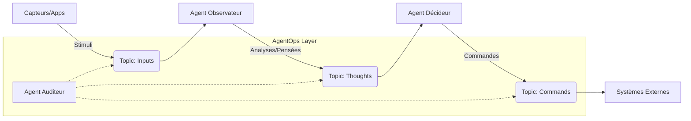

Voici la **Vision Stratégique (Constitution)** et le fichier **README.md** technique pour votre projet, structurés selon vos exigences de clarté, de rigueur architecturale et de raisonnement par les premiers principes.

Ce contenu est prêt à être intégré dans la racine de votre dépôt Git.

---

# PARTIE 1 : LA CONSTITUTION DU PROJET (Vision & Principes)

Ce document sert de boussole architecturale. Il définit les règles immuables qui gouvernent le design du système, garantissant que l'entropie des agents n'affecte pas la stabilité de l'entreprise.

## 📜 Constitution de l'Entreprise Agentique (The Agentic Constitution)

### 1. La Thèse Centrale

> *"Le déterminisme de l'infrastructure est le seul rempart contre le probabilisme des Agents."*

Nous ne cherchons pas à rendre les LLM parfaits. Nous construisons un système nerveux (Kafka) infalsifiable qui contient, observe et audit les imperfections des modèles probabilistes pour créer des processus métier fiables.

### 2. Les Premiers Principes (Non-Négociables)

1. **L'État est un Flux (State as a Stream) :** Aucune base de données n'est la source de vérité. La vérité est la séquence immuable des événements dans Kafka. Les bases de données ne sont que des projections (Vues) de ce flux.
2. **Transparence Cognitive (Thought-Action-Log) :** Un agent ne doit jamais agir sans avoir préalablement publié son intention et son raisonnement. L'auditabilité précède l'autonomie.
3. **Découplage Temporel Absolu :** Aucun agent n'attend la réponse d'un autre de manière synchrone. Le système est conçu pour la latence variable et la panne partielle.
4. **Sécurité par le Schéma :** Tout échange de données est régi par un contrat strict (Avro/Protobuf). Si le message ne valide pas le schéma, il n'existe pas.

### 3. Objectifs Stratégiques

* **Interopérabilité :** Connecter des systèmes hétérogènes (Legacy, SaaS, IA) sans couplage point-à-point.
* **Observabilité (AgentOps) :** Détecter la dérive cognitive et les coûts avant qu'ils n'impactent le métier.
* **Résilience :** Le système survit à l'hallucination d'un agent individuel.

---

# PARTIE 2 : LE README TECHNIQUE

Copiez le contenu ci-dessous dans votre fichier `README.md`.

```markdown
# Agent Mesh Kafka: Reference Architecture

> **Interopérabilité Agentique & Orchestration Événementielle**

[]() []() []()

## 🎯 Vision du Produit
**Agent Mesh Kafka** est une implémentation de référence (Blueprints) pour l'Entreprise Agentique. Ce projet démontre comment transformer des applications passives (CRUD) en écosystèmes proactifs où des agents autonomes collaborent via un **Bus Cognitif Central**.

Il s'appuie sur le document académique *« Architecture – Maillage Agentique et AgentOps »* pour industrialiser l'IA générative via des pratiques DevOps rigoureuses.

## 🔭 Portée (Scope)

Ce projet couvre le cycle de vie complet de l'ingénierie agentique :
1.  **Infrastructure :** Déploiement d'un cluster Kafka sécurisé et gestion des schémas (Schema Registry).
2.  **Pattern Architectural :** Implémentation du pattern *Cognitive Sidecar* (découplage Legacy/IA).
3.  **Implémentation de Référence :** Transformation du repo `habit-tracker` (Python/FastAPI) en un nœud agentique.
4.  **AgentOps :** Outillage pour l'évaluation (Evaluation Diamond), le monitoring et la sécurité (AgentSec).

## 🏗 Architecture

Le système repose sur une topologie de topics stricte :



### Concepts Clés

* **Cognitive Log :** Kafka agit comme la mémoire à long terme distribuée.
* **Thought-Action Protocol :** Séparation explicite entre le raisonnement (interne) et l'effet de bord (externe).
* **Guardrails :** Validation des messages à l'entrée et à la sortie du Mesh.

## 🛠 Stack Technologique

### Runtime (Production)

* **Backbone :** Apache Kafka (Confluent Cloud / Redpanda).
* **Format de Données :** Avro (Schemas stricts).
* **Agents Framework :** Python 3.11+, LangGraph (Orchestration), LangChain.
* **Modèles (LLM) :** Claude 3.5 Sonnet (Logique complexe), Gemini 1.5 Pro (Contexte long), GPT-4o-mini (Tâches rapides).

### Development (Engineering Stack)

* **Recherche & Veille :** Perplexity Pro.
* **Code & Design :** Claude 3.5 Sonnet & Claude Code.
* **Review & Analyse Massive :** Gemini 1.5 Pro.
* **Documentation :** Microsoft Copilot.

## 📂 Structure du Projet

```text
/
├── schemas/                # Single Source of Truth (Avro/Protobuf definitions)
│   ├── events/             # Domain events (ex: HabitLogged)
│   └── commands/           # Agent commands (ex: SendNotification)
├── infrastructure/         # IaC (Terraform/Docker Compose for Kafka)
├── agents/                 # Code source des Agents (Microservices)
│   ├── observer_agent/     # Analyseur de patterns
│   └── coach_agent/        # Générateur d'interactions
├── legacy_adapter/         # Sidecar pour l'app existante (habit-tracker)
├── agent_ops/              # Outils d'évaluation et Dashboard de monitoring
└── docs/                   # ADRs (Architecture Decision Records)

```

## 🚀 Roadmap

### Phase 1 : Infrastructure & Contrats (Fondations)

* [ ] Monter le cluster Kafka local (Docker).
* [ ] Définir le schéma universel `AgentMessage.avsc`.
* [ ] Établir le pipeline CI/CD pour le registre de schémas.

### Phase 2 : Le Nœud Agentique (Capabilities)

* [ ] Créer le "Producer" télémétrique pour l'application `habit-tracker`.
* [ ] Développer l'Agent Observateur (Stateless Consumer).
* [ ] Implémenter la boucle de rétroaction (Feedback Loop).

### Phase 3 : AgentOps & Sécurité (Industrialisation)

* [ ] Déployer l'Agent Auditeur (Juge LLM).
* [ ] Implémenter les tests de non-régression cognitive.
* [ ] Simulation "Red Team" (Injection de prompt dans le bus).

## 🤝 Contribution & Standards

* **Langue :** Code en Anglais, Documentation en Français/Anglais.
* **Commit Style :** Conventional Commits.
* **Règle d'or :** *Documentation as Code*. Chaque décision d'architecture doit être un ADR.

---

*Architecte Principal : [Votre Nom/Pseudo]*
*Basé sur les travaux de recherche "Maillage Agentique et AgentOps" (2025).*

```

```